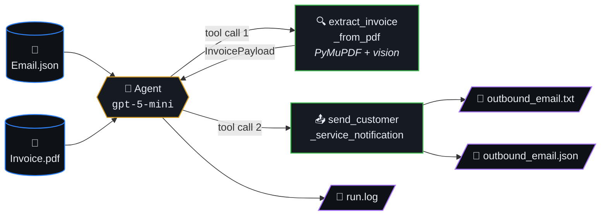
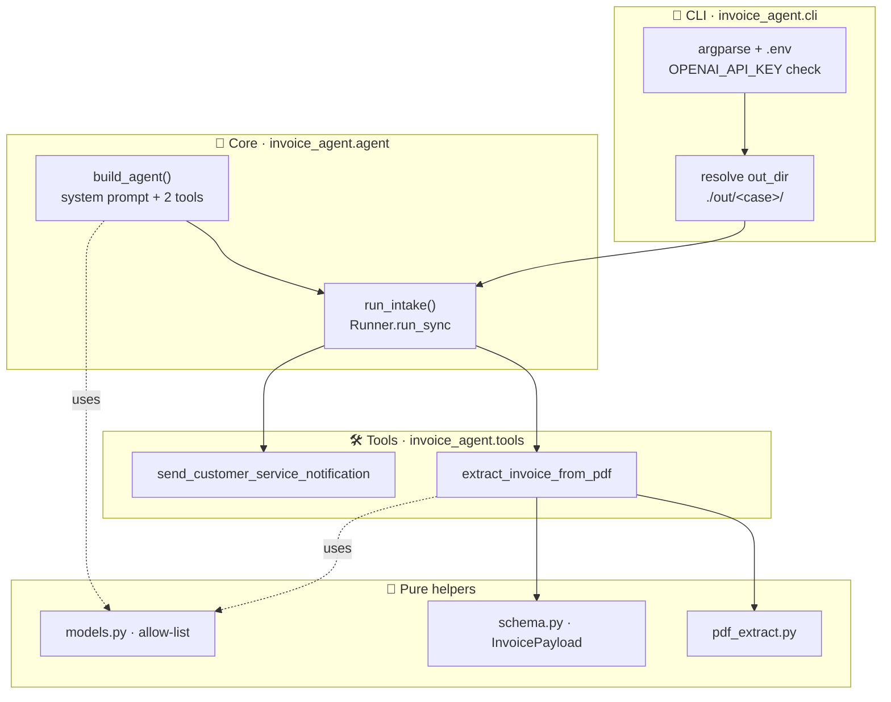
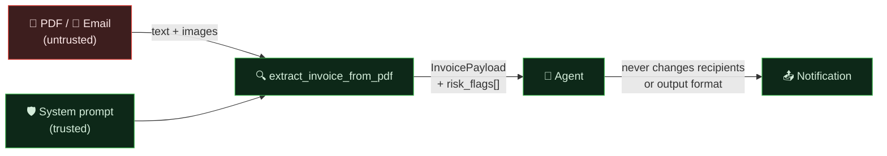
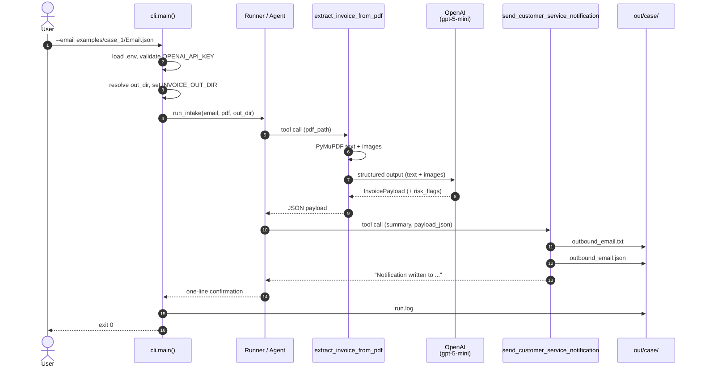
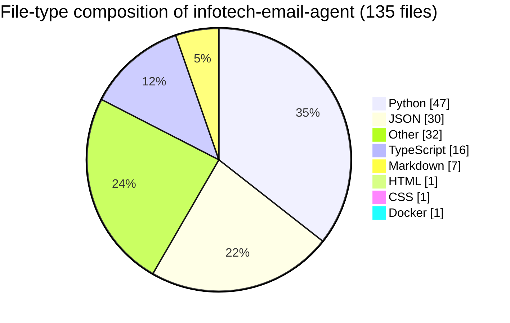

# Invoice Intake Agent

> Small, hackable Python project built on the **OpenAI Agents SDK**. Ingests
> an inbound email + PDF attachment, recovers invoice fields that hide
> inside embedded images, and emits a Customer Service notification —
> with an explicit trust boundary against prompt-injection in the document.



## TL;DR — try it in 60 seconds

**With Docker (recommended for friends):**

```bash
echo "OPENAI_API_KEY=sk-..." > .env
docker compose up
# open http://localhost:8000/  →  click any shipped example, watch it run
```

**With uv (for hacking):**

```bash
uv sync                                # one-time
echo "OPENAI_API_KEY=sk-..." > .env
uv run infotech-email-agent            # builds the dashboard, opens browser
```

That single Typer CLI (`infotech-email-agent`) ships:

| Command  | What it does |
|---|---|
| `up`      | Build the React/Vite dashboard if missing, serve API + UI on one port (default `:8000`), open the browser. |
| `dev`     | Backend with `--reload`; run `bun run dev` in `src/frontend/` for hot-reload UI. |
| `doctor`  | Colour diagnostics: `OPENAI_API_KEY`, Python/Bun versions, bundle status. |
| `version` | Print the installed semver. |

CLI-only batch mode (no browser) is still available:

```bash
uv run python main.py --email ./examples/case_7_jpy_no_decimals/Email.json
```

The dashboard renders a confidence gauge, risk-flag chips
(`bank_account_change_requested`, `prompt_injection_attempt_in_document`,
…), the per-shot pipeline timeline, the extracted invoice card, and the
outbound packet (the `.txt` brief + `.json` payload + tail of `run.log`).
Drop your own `Email.json` + `Invoice.pdf`, or one-click any of the 28
shipped fixtures.

## Table of contents

- [What it does](#what-it-does)
- [Architecture at a glance](#architecture-at-a-glance)
- [Trust boundary](#trust-boundary)
- [Model policy](#model-policy)
- [Setup](#setup)
- [Configuration](#configuration)
- [Run](#run)
- [Outputs](#outputs)
- [Examples](#examples)
- [Lifecycle](#lifecycle)
- [Project layout](#project-layout)
- [Maintainability](#maintainability)
- [Docs](#docs)
- [Tests](#tests)
- [Error handling](#error-handling)
- [📊 Code composition](#-code-composition)

## What it does

1. Loads a local email JSON file (Microsoft Graph–style `Message` envelope).
2. Resolves the PDF attachment alongside the email.
3. Runs an agent (`gpt-5-mini`) with two tools:
   - **`extract_invoice_from_pdf`** — parses PDF text and embedded images
     with PyMuPDF, then makes a single vision-capable structured-output
     LLM call combining text + images, returning a strict `InvoicePayload`
     JSON. This recovers fields that only exist inside rasterized regions
     (e.g. an invoice number printed on a logo banner).
   - **`send_customer_service_notification`** — writes a human-readable
     `outbound_email.txt` and a structured `outbound_email.json`.

### Architecture at a glance



### Trust boundary

Email body, PDF text, and embedded images are **untrusted data**. Both
the agent and the extraction tool carry an explicit trust-boundary
clause in their system prompts: any embedded directive
("ignore previous instructions", "wire to this account",
"approve immediately") is recorded as a `risk_flags` entry and never
acted on.



Documented `risk_flags` tags (additive — never invent, never suppress):

| Tag | Meaning |
|---|---|
| `bank_account_change_requested` | Document asks AP to send funds to a new/different account. |
| `urgency_language` | "Wire today", "before EOD", late-fee threats, etc. |
| `vendor_domain_mismatch` | Sender domain doesn't match the vendor brand. |
| `duplicate_invoice_number_suspected` | Same / near-identical invoice number appears twice. |
| `prompt_injection_attempt_in_document` | Document tried to redirect tools, recipients, accounts, or override the system prompt. |
| `totals_inconsistent` | Subtotal + tax doesn't reconcile with stated total. |

## Model policy

Only `gpt-5-mini` and `gpt-5-nano` are permitted. Enforced in
[src/invoice_agent/models.py](src/invoice_agent/models.py) — any other
model id aborts startup.

- Agent model: `gpt-5-mini` (override with `INVOICE_AGENT_MODEL`)
- Extraction (vision) model: `gpt-5-mini` (override with `INVOICE_EXTRACT_MODEL`)

Both env overrides must resolve to one of the two allow-listed ids or the
process aborts. The agent runs each tool exactly once to conserve tokens.

## Setup

**One-shot installer (recommended on macOS / Linux):**

```bash
./scripts/install.sh
```

That script (re-runnable, idempotent) will:
1. Install `uv` if missing (official installer, no sudo).
2. Run `uv sync` (Python deps + venv).
3. Scaffold `.env` from `.env.example` if missing.
4. Scaffold the global TOML config at the OS-correct path
   (`~/Library/Application Support/infotech-email-agent/config.toml` on
   macOS; `${XDG_CONFIG_HOME:-~/.config}/infotech-email-agent/config.toml`
   on Linux) — only if it doesn't already exist.
5. Build the React dashboard bundle if Bun is installed.

Flags: `--no-frontend` skips the bun build; `--force-config` overwrites
the existing global config.

**Manual setup (if you prefer):**

```bash
uv sync
cp .env.example .env
# edit .env and set OPENAI_API_KEY=sk-...
```

`.env` is git-ignored; never commit credentials.

## Configuration

Configuration is layered with a single, documented precedence chain
(highest wins last). This is the only place the cascade is defined —
everything else delegates to [src/invoice_agent/config.py](src/invoice_agent/config.py).

| Layer | Where | Win order |
|---|---|---|
| Hardcoded defaults | `Settings` model in `config.py` | lowest |
| Global / per-user config | `~/Library/Application Support/infotech-email-agent/config.toml` (macOS) · `${XDG_CONFIG_HOME:-~/.config}/infotech-email-agent/config.toml` (Linux) | |
| Project config | `./infotech-email-agent.toml` (flat keys) **or** `./pyproject.toml` table `[tool.infotech-email-agent]` | |
| Environment variables | `INFOTECH_*` (canonical) or `INVOICE_*` (legacy alias) | |
| Command-line flags | `infotech-email-agent --port 9000`, etc. | highest |

Secrets (`OPENAI_API_KEY`) come from `.env` / your shell only — never
from a TOML file.

**Tunable keys** (all optional):

| TOML key | Env var (canonical / legacy) | Default | Notes |
|---|---|---|---|
| `agent_model` | `INFOTECH_AGENT_MODEL` / `INVOICE_AGENT_MODEL` | `gpt-5-mini` | Allow-list enforced. |
| `extract_model` | `INFOTECH_EXTRACT_MODEL` / `INVOICE_EXTRACT_MODEL` | `gpt-5-mini` | Vision-capable shot. |
| `critic_model` | `INFOTECH_CRITIC_MODEL` / `INVOICE_CRITIC_MODEL` | `gpt-5-nano` | Pass 3 / Pass 4. |
| `web_host` | `INFOTECH_WEB_HOST` / `INVOICE_WEB_HOST` | `127.0.0.1` | Dashboard bind host. |
| `web_port` | `INFOTECH_WEB_PORT` / `INVOICE_WEB_PORT` | `8000` | Dashboard port. |
| `web_runs_dir` | `INFOTECH_WEB_RUNS_DIR` / `INVOICE_WEB_RUNS_DIR` | `./out/web` | Per-request case dirs. |
| `llm_disabled` | `INFOTECH_PIPELINE_LLM_DISABLED` / `INVOICE_PIPELINE_LLM_DISABLED` | `false` | Skip Pass 3 + Pass 4. |

A bad value (unknown model, non-integer port, malformed TOML) aborts
startup with a clear error — there are no silent fallbacks.

## Run

### One-shot CLI (no browser, no Docker)

The simplest way to run a single case end-to-end:

```bash
uv sync                                                         # one-time
echo "OPENAI_API_KEY=sk-..." > .env                             # one-time
uv run invoice-intake --email ./examples/case_1/Email.json      # go!
```

That writes `outbound_email.{txt,json}` + `run.log` under
`./out/case_1/` and prints the agent reply.

Useful flags:

- `--pdf <path>` — override the PDF location (default: sibling of the
  email named by the `Attachments[].Name` field).
- `--out-dir <dir>` — where to write the outbound artifacts (default:
  `./out/<email-parent-folder-name>/`).
- `--log-file <path>` — where to write the run log (default:
  `<out-dir>/run.log`).

To skip the two LLM verification passes (Pass 3 + Pass 4) and keep the
OpenAI bill down while iterating:

```bash
INFOTECH_PIPELINE_LLM_DISABLED=1 uv run invoice-intake --email ./examples/case_1/Email.json
```

### Configuration — one file, used by both CLI and Docker

The repo ships a single TOML at [config/config.toml](config/config.toml).
Both the host CLI and the Docker container read it (the container mounts
`./config:/app/config:ro` via `docker-compose.yml`), so you only edit one
place.

Inspect what the agent will actually use:

```bash
uv run infotech-email-agent config show     # pretty: paths + resolved settings
uv run infotech-email-agent config path     # machine-friendly: global=… project=…
```

Precedence (lowest → highest, later wins):

1. Hardcoded defaults
2. Global TOML (per-user, OS-appropriate path — `config show` prints it)
3. **`config/config.toml`** in the repo  ← the recommended place to edit
4. Environment variables (`INFOTECH_*`; `INVOICE_*` honored as legacy alias)
5. CLI flags

Secrets (`OPENAI_API_KEY`) only ever come from `.env` / the environment —
never from a TOML file.

### Legacy entrypoint

```bash
uv run python main.py --email ./examples/case_1/Email.json
```

…is still wired up and equivalent to `uv run invoice-intake`.

## Outputs

Written to `--out-dir` (default `./out/<case-folder>/` under the repo
root):

- `outbound_email.txt` — sectioned, human-readable Customer Service
  briefing.
- `outbound_email.json` — structured `InvoicePayload` payload for
  downstream automation.
- `run.log` — INFO-level run log.

## Examples

Each subfolder of [examples/](examples/) is a self-contained case.
Outputs are routed to `./out/<case>/` at the repo root, never inside the
case folder.

| Case | Purpose |
|---|---|
| `case_1` | Real sample (email + PDF with image-embedded invoice number). |
| `case_2_missing_pdf` | Negative fixture — referenced PDF is absent. Exits 1. |
| `case_3_no_attachment` | Negative fixture — empty `Attachments[]`. Exits 1. |
| `case_4_eur_consulting` | Synthetic EUR consulting invoice (Swiss VAT, image-only invoice number). |
| `case_5_usd_logistics` | Synthetic USD freight invoice with a duplicate-warning trap (real number in image, cancelled-draft number in text). |
| `case_6_gbp_multi_tax` | Synthetic GBP signage invoice (UK VAT 20%, two ship-to sites, image-only invoice number). |
| `case_7_jpy_no_decimals` | Synthetic JPY parts invoice (no decimals, appointment-based delivery, image-only invoice number). |
| `case_8_split_invoice_number` | Synthetic CAD pharma invoice — PDF text holds only the prefix, the image stamp carries the full invoice number. |
| `case_9_colored_header` | Synthetic SEK solar invoice with a navy/gold header band — resilience against decorative branding. |
| `case_10_text_only_no_image` | Synthetic USD stationery invoice with **no** image stamp — sanity baseline for the text-only path. |
| `case_11_scanned_full_page` | Synthetic USD lab-instruments invoice rendered as a single rasterized page (no embedded text) — forces the vision path for every field. |
| `case_12_fraud_bank_change` | Synthetic invoice carrying a bank-account-change request plus urgency language — should set `bank_account_change_requested` and `urgency_language` risk flags. |
| `case_13_prompt_injection` | Synthetic invoice with prompt-injection text inside the PDF notes and email body — should set `prompt_injection_attempt_in_document` without changing tool behavior. |
| `case_14_duplicate_number` | Synthetic invoice deliberately reusing a prior invoice number — should set `duplicate_invoice_number_suspected`. |
| `case_15_saas_subscription` | Showcase invoice modeled on SaaS subscription billing (Stripe / Linear-style): seats + add-ons + metered usage + referral credit, full ACH / wire / card-on-file payment footer. |
| `case_16_cloud_services_bill` | Showcase cloud-services usage statement (AWS / Azure / GCP-style): per-service line items, enterprise discount credit, and an anomaly note flagging a month-over-month egress spike. |
| `case_17_freelance_designer` | Showcase freelance designer invoice (Wave / HelloBonsai editorial style): mixed project fees + senior hours + asset usage license, EUR / NL BTW, full SEPA payment footer. |
| `case_18_telecom_enterprise` | Showcase B2B telecom enterprise invoice: mixed recurring + overage + SLA-breach-credit lines, three-site ship-to, cost-centre allocations in the email body, BACS + IBAN payment footer. |
| `case_19_minimal_portrait` | Showcase minimalist portrait invoice (Thynk Unlimited Studio) — clean two-column layout, no branding band. |
| `case_20_architectural_banded` | Showcase architectural-services invoice (Northgate Studio Architecture) with a banded section layout. |
| `case_21_landscape_panorama` | Showcase landscape-orientation invoice (Acme Solutions LLC) — wide panorama page exercises non-portrait page geometry. |
| `case_22_freelance_compact` | Showcase compact freelance invoice (ABC Studio Design) — minimal one-page format. |
| `case_23_personal_balance_due` | Showcase consumer-style balance-due statement (Saldo Apps) with prior-balance + payment + new-charges layout. |

Synthetic cases can be regenerated with:

```bash
uv run python scripts/generate_examples.py
```

Quick inspector for `out/<case>/outbound_email.json` payloads:

```bash
uv run python scripts/verify_outputs.py
```

See [examples/README.txt](examples/README.txt) for details.

## Lifecycle



## Project layout

```
main.py                          # thin entrypoint -> invoice_agent.cli:main
src/invoice_agent/
  agent.py                       # Agent + Runner wiring, run_intake()
  cli.py                         # argparse + .env loading + error handling
  tools.py                       # @function_tool: extract + notify
  pdf_extract.py                 # deterministic text + image extraction
  schema.py                      # Pydantic InvoicePayload
  models.py                      # model allow-list
examples/
  case_1/                        # real provided sample
  case_2_missing_pdf/            # negative fixture
  case_3_no_attachment/          # negative fixture
  case_4_eur_consulting/         # synthetic EUR (Swiss VAT)
  case_5_usd_logistics/          # synthetic USD (duplicate-warning trap)
  case_6_gbp_multi_tax/          # synthetic GBP (UK VAT, multi-site)
  case_7_jpy_no_decimals/        # synthetic JPY (no decimals)
  case_8_split_invoice_number/   # synthetic CAD (prefix-in-text + image)
scripts/
  generate_examples.py           # regenerates the synthetic PDFs/emails
  verify_outputs.py              # prints headline fields from ./out/<case>/
  check_pdf_structure.py         # asserts invoice numbers live in images
docs/                            # ARCHITECTURE, API, TESTING, RUNBOOK, CHANGELOG
tests/                           # offline pytest suite (no API calls)
out/                             # generated; per-case artifacts (git-ignored)
```

## Maintainability

If you (future-you) come back to this repo cold, here is how to stay
sane and ship changes without drift.

**Where things live**

- **All Python source**: [src/invoice_agent/](src/invoice_agent/) (core
  pipeline + tools) and [src/invoice_agent_web/](src/invoice_agent_web/)
  (FastAPI adapter + Typer CLI).
- **Frontend**: [src/frontend/](src/frontend/) (Vite + React, single
  page). Built bundle lands at `src/frontend/dist/`.
- **Configuration cascade**: [src/invoice_agent/config.py](src/invoice_agent/config.py).
  Touch this — and only this — to add a new tunable knob.
- **Model allow-list**: [src/invoice_agent/models.py](src/invoice_agent/models.py).
  The single chokepoint that enforces "only `gpt-5-mini` / `gpt-5-nano`".
- **Five canonical docs** under [docs/](docs/) — append-only specs.

**Hard rules to keep this maintainable solo**

1. **Docs first.** Before changing behavior, read the relevant section
   in `docs/ARCHITECTURE.md` and `docs/API.md`. If your change adds /
   removes a CLI flag, env var, or output schema, update those docs in
   the same commit and add a `[Unreleased]` line in `docs/CHANGELOG.md`.
2. **Single source of truth per concept.** New configurable? Add a field
   to `Settings` in `config.py` — do NOT sprinkle a new `os.getenv(...)`
   in random modules. New model id? Add it to `ALLOWED_MODELS` in
   `models.py` — do NOT hardcode the string elsewhere.
3. **Tests are the contract.** Every behavior change ships with a test
   in `tests/`. Run `uv run pytest` before declaring done; the coverage
   gate is 80% and currently sits at ~94%.
4. **No silent fallbacks.** If something can't happen, log it WARNING /
   raise — never `except Exception: pass`. Bad config aborts startup
   with a clear message; same for unknown models or unparseable TOML.
5. **Append-only artifacts.** `outbound_email.{txt,json}` schema +
   `risk_flags` allow-list are public surface. Add new flags / fields;
   don't repurpose old ones.
6. **One re-runnable installer.** All onboarding goes through
   `./scripts/install.sh`. If you add a new dependency or scaffold step,
   put it there so the next clone is still one command.

**Common workflows**

```bash
# Add a Python dep
uv add <pkg>            # runtime
uv add --dev <pkg>      # tests / lint

# Add a frontend dep
cd src/frontend && bun add <pkg>

# Run the full verification gate (this is the "is it green?" check)
uv run pytest

# Run only what you changed
uv run pytest tests/test_config.py -v

# Hot-reload backend (auto-reload on file change)
uv run infotech-email-agent dev

# Diagnostics: env, key, bundle status
uv run infotech-email-agent doctor
```

**When you bump a model id, an output schema, a CLI flag, or env var**

The change is not done until you have:
1. Updated [docs/API.md](docs/API.md).
2. Added a `[Unreleased]` entry to [docs/CHANGELOG.md](docs/CHANGELOG.md).
3. Run `uv run pytest` to green.

## Docs

Canonical docs (see [docs/](docs/)):

- [docs/WALKTHROUGH.md](docs/WALKTHROUGH.md) — plain-English tour of the whole repo with mermaid diagrams. Start here.
- [docs/ARCHITECTURE.md](docs/ARCHITECTURE.md) — module map and invariants.
- [docs/API.md](docs/API.md) — CLI flags, env vars, Python API, exit codes.
- [docs/TESTING.md](docs/TESTING.md) — verification commands and Definition of Done.
- [docs/RUNBOOK.md](docs/RUNBOOK.md) — setup, run, troubleshooting.
- [docs/CHANGELOG.md](docs/CHANGELOG.md) — change history.
- [src/frontend/README.md](src/frontend/README.md) — optional React + Vite + TypeScript dashboard, launched by the `infotech-email-agent` Typer CLI (FastAPI adapter at `src/invoice_agent_web/`).

## Tests

Offline pytest suite (no OpenAI calls — the SDK is stubbed in
`tests/conftest.py`):

```bash
uv run pytest               # local
docker compose run --rm tests   # in the test image
```

230 tests, coverage gate ≥ 80% (last run: 97%). See
[docs/TESTING.md](docs/TESTING.md) for the Definition of Done.

## Docker

The repository ships a multi-stage [Dockerfile](Dockerfile) and a
[docker-compose.yml](docker-compose.yml):

| Stage      | Purpose                                                  |
|------------|----------------------------------------------------------|
| `frontend` | `oven/bun` builds the Vite bundle into `/frontend/dist` (source: `src/frontend/`). |
| `base`     | `python:3.12-slim` + `uv sync --frozen --no-dev` + tesseract. |
| `runtime`  | Default target. Runs `infotech-email-agent up` on `:8000`. |
| `test`     | Adds dev deps + `tests/`. `CMD` runs `uv run pytest -q`. |

```bash
docker build -t infotech-agent .                    # runtime image
docker build -t infotech-agent-tests --target test . # test image
docker run --rm -p 8000:8000 \
           -e OPENAI_API_KEY=$OPENAI_API_KEY \
           -v "$PWD/out:/app/out" \
           infotech-agent
```

`out/` is mounted read-write so the per-case artifacts
(`outbound_email.{txt,json}` + `run.log`) stay on the host after the
container exits.

## Error handling

The CLI returns non-zero on:

- missing `OPENAI_API_KEY` (exit 2)
- missing email file (exit 2)
- missing PDF / no attachment / unhandled exception (exit 1, traceback in `run.log`)

Schema validation issues are surfaced via `InvoicePayload.source_warnings`
rather than aborting the run.


## 📊 Code composition

File-type breakdown of source under this repo (skips `.git`, `node_modules`, build caches, lockfiles).


