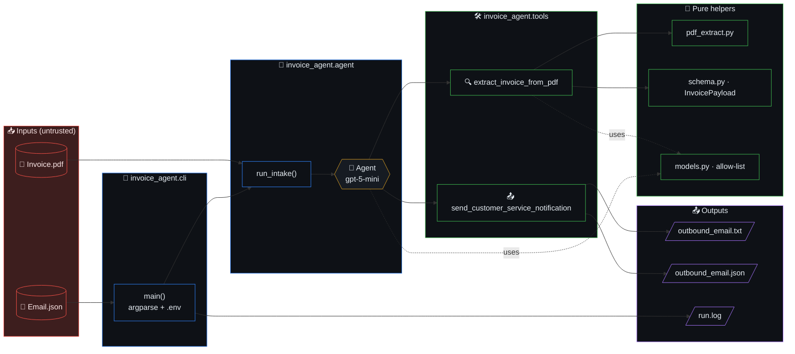
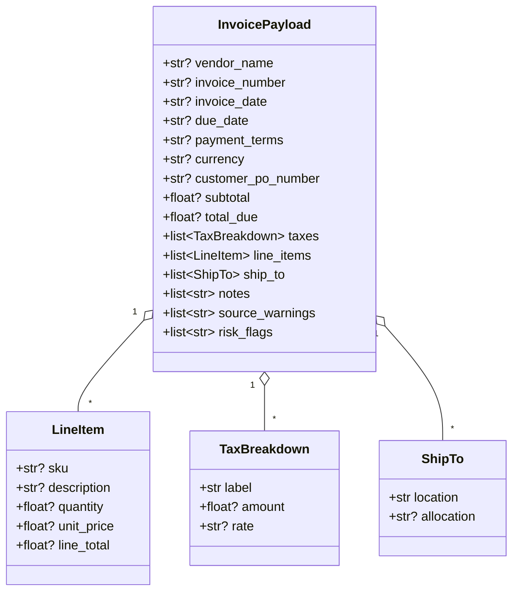

# Architecture

Single-purpose CLI that runs an OpenAI Agents SDK agent over one email + one
PDF and emits a Customer Service notification.

## Table of contents

- [High-level diagram](#high-level-diagram)
- [Layers](#layers)
- [Module map](#module-map)
- [Data flow (sequence)](#data-flow-sequence)
- [InvoicePayload schema](#invoicepayload-schema)
- [Architectural invariants](#architectural-invariants)

## High-level diagram



## Layers

```
main.py  ──►  invoice_agent.cli.main()
                │
                ├── load .env, validate OPENAI_API_KEY
                ├── resolve out_dir = ./out/<case-folder-name>/
                └── invoice_agent.agent.run_intake(email, pdf, out_dir)
                        │
                        ├── parse email JSON, resolve sibling PDF
                        ├── export INVOICE_OUT_DIR for tools
                        └── Runner.run_sync(Agent, user_prompt)
                                │
                                ├─ tool: extract_invoice_from_pdf
                                │     - PyMuPDF text per page
                                │     - PyMuPDF + Pillow extract embedded images
                                │     - one combined vision call (text + all images)
                                │       returning a parsed InvoicePayload
                                │
                                └─ tool: send_customer_service_notification
                                      - writes outbound_email.txt
                                      - writes outbound_email.json
```

## Module map

| Module | Responsibility |
|---|---|
| `invoice_agent/cli.py` | Argparse, .env, logging, exit codes. |
| `invoice_agent/agent.py` | Agent assembly + multi-shot pipeline driver (`run_intake`). |
| `invoice_agent/pipeline.py` | `PipelineState` confidence ledger; per-shot decision records. Each `Shot` carries `findings: list[str]` (the snake_case finding tags) and **`evidence: list[Evidence]`** (the AP-facing pointer back to the exact substring that triggered each finding — additive, defaults to `[]`). |
| `invoice_agent/evidence.py` | **Pure helpers** that turn a finding tag + its source text into an `Evidence` entry: regex-window quotes for `_INJECTION_PATTERNS` matches, structured quotes for verifier `Disagreement`s, numeric reconstructions for `arithmetic_check`. No I/O, no LLM. The same compiled regexes from `guardrails` are re-used (single source of truth). |
| `invoice_agent/guardrails.py` | Deterministic guardrails: input/output injection scan, `arithmetic_check`. |
| `invoice_agent/verifier.py` | LLM critic (`verify_extraction`) + LLM `injection_screen` (gpt-5-nano). |
| `invoice_agent/tools.py` | The two `@function_tool`s (extract + notify). |
| `invoice_agent/pdf_extract.py` | Deterministic PDF text + image extraction. |
| `invoice_agent/schema.py` | Pydantic `InvoicePayload` + nested models, plus the additive `Evidence` model (`finding`, `source`, `quote`, `location`) used by `pipeline.Shot.evidence`. |
| `invoice_agent/models.py` | Allow-list (`gpt-5-mini` / `gpt-5-nano`) + default model constants. |
| `invoice_agent/_retry.py` | Bounded retry helper (LLM + OCR shots). Single source of truth for retry policy. |
| `invoice_agent/_llm_params.py` | Single source of truth for the 2026 GPT-5 safety / cost knobs forwarded on every `responses.parse(...)` call: `reasoning.effort`, `text.verbosity`, `max_output_tokens`, `safety_identifier`, `prompt_cache_key`. Per-shot defaults: extract = `minimal` effort + 2048 tokens; verify = `low` effort + 1024 tokens; injection = `minimal` effort + 256 tokens. |
| `invoice_agent_web/main.py` | **HTTP adapter** (FastAPI). Exposes `/api/health`, `/api/examples`, `/api/intake` (multipart upload), `/api/intake/example`. When `frontend/dist/` exists, also mounts the React bundle at `/` and `/assets/*` so the whole app runs on one port. Owns no business logic — stages inputs into a per-request case dir under `out/web/` and calls `invoice_agent.agent.run_intake`. Sync handlers (Agents SDK `Runner.run_sync` cannot run inside an active event loop). |
| `invoice_agent_web/cli.py` | **Typer CLI** (console-script `infotech-email-agent`). Subcommands: `up` (build frontend + serve everything), `dev` (backend with reload + Vite-dev instructions), `doctor` (env / deps), `version`. Prints ASCII banner + colour diagnostics. |
| `frontend/` | React + Vite + TypeScript dashboard. Renders the confidence gauge, per-shot timeline, risk-flag chips, extracted invoice, and outbound packet (txt / JSON / log) returned by `/api/intake`. Dev server (`bun run dev`) proxies `/api/*` to the FastAPI backend. See `frontend/README.md`. |
| `Dockerfile` / `docker-compose.yml` / `.dockerignore` | **Containerization layer.** Multi-stage build (`frontend` via `oven/bun` → `base` via `python:3.12-slim` + `uv sync --frozen --no-dev` + `tesseract-ocr` → `runtime` exposing `:8000` → `test` running `uv run pytest -q`). The `runtime` target runs `infotech-email-agent up --no-browser`; the `test` target is invoked via `docker compose run --rm tests`. No business logic lives here — pure packaging. See `docs/RUNBOOK.md`. |

## Data flow (sequence)

```mermaid
sequenceDiagram
    autonumber
    actor User
    participant CLI as cli.main()
    participant Agent as Runner / Agent
    participant Extract as extract_invoice_from_pdf
    participant PDF as pdf_extract
    participant Vision as OpenAI<br/>(gpt-5-mini)
    participant Notify as send_customer_service_notification
    participant FS as ./out/&lt;case&gt;/

    User->>CLI: --email examples/case_X/Email.json
    CLI->>CLI: load .env, validate OPENAI_API_KEY
    CLI->>CLI: resolve out_dir, set INVOICE_OUT_DIR
    CLI->>Agent: run_intake(email, pdf, out_dir)
    Agent->>Extract: tool call (pdf_path)
    Extract->>PDF: extract_pdf_content()
    PDF-->>Extract: text + image bytes
    Extract->>Vision: structured output (text + images)
    Vision-->>Extract: InvoicePayload (+ risk_flags)
    Extract-->>Agent: JSON payload
    Agent->>Notify: tool call (summary, payload_json)
    Notify->>FS: outbound_email.txt
    Notify->>FS: outbound_email.json
    Notify-->>Agent: "Notification written to ..."
    Agent-->>CLI: one-line confirmation
    CLI->>FS: run.log
    CLI-->>User: exit 0
```

## InvoicePayload schema



## Architectural invariants

- **Model allow-list.** Only `gpt-5-mini` and `gpt-5-nano`. Enforced in
  `models.resolve_model`. Any other id aborts startup. Every LLM call
  routes its kwargs through `_llm_params.llm_params(...)` so the safety
  identifier, verbosity, reasoning effort, token cap, and prompt-cache
  key are consistent across `extract` / `verify` / `injection` shots.
- **Each shot runs at most once per run.** The pipeline is a fixed
  ordered sequence (`pre_flight`, `extract`, `arithmetic_check`,
  `critic_review`, `injection_screen`, `synthesis_finalise`); no shot
  re-invokes itself. Token budget discipline.
- **No silent fallbacks.** Missing PDF, unreadable image, schema validation
  warnings all surface (raise or `source_warnings`).
- **Bounded retry, single source of truth.** Every LLM and OCR shot
  routes through `_retry.retry_call`. Defaults: 3 attempts (LLM) /
  2 attempts (OCR) with exponential back-off. Allow-list errors
  (`ValueError` from `resolve_model`) are NOT retried — programmer
  bugs surface on attempt 1. Exhausted retries flow to the existing
  `state.fail(...)` shot. No callsite implements its own retry policy.
- **Centralised LLM call parameters.** Every `responses.parse(...)`
  call (extract, verify, injection screen) sources its safety / cost
  knobs from `_llm_params.llm_params(shot=...)`. This is the single
  source of truth for `reasoning.effort`, `text.verbosity`,
  `max_output_tokens`, `safety_identifier`, and `prompt_cache_key`.
  Hard-coding these at any call site is forbidden — change the
  defaults in `_llm_params.py` once, get it everywhere.
- **Refusals are flagged, not retried.** When Structured Outputs
  declines a request, `tools._extract_refusal` detects the refusal
  string (top-level or nested in `output[*].content[*].refusal`) and
  returns an `InvoicePayload` with `risk_flags=["model_refused_extraction"]`
  and the refusal text echoed in `source_warnings`. Refusals are
  deterministic — burning 3 retry attempts on them wastes spend and
  hides the signal from the AP human.
- **Outputs are case-scoped.** `./out/<case-folder>/` keeps runs separate
  without polluting the example directories.
- **Secrets via env only.** `.env` is git-ignored; `.env.example` is the
  documented contract.
- **`INVOICE_OUT_DIR` is a per-run side-channel.** `agent.run_intake` sets
  it before invoking `Runner.run_sync`; `tools.send_customer_service_notification`
  reads it. The constant name lives in `tools.OUT_DIR_ENV` (single source
  of truth). Do not set it manually.
