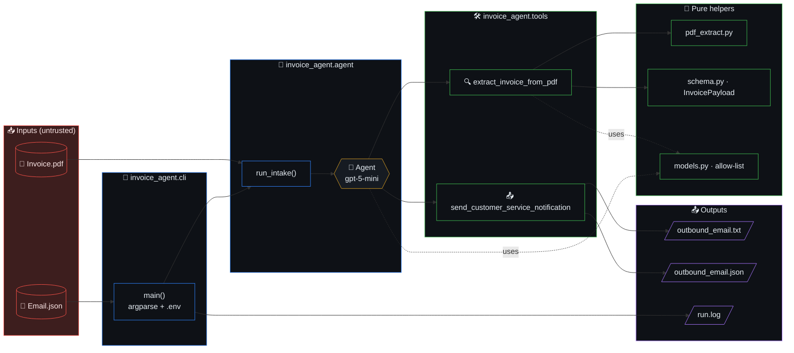
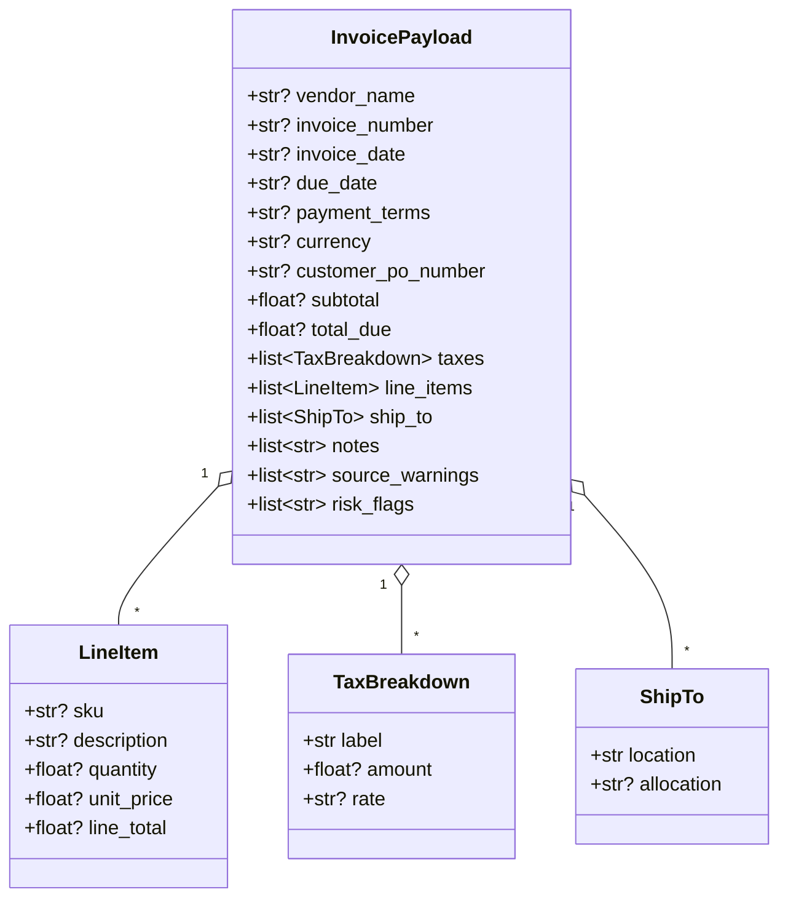

# Architecture

Single-purpose CLI that runs an OpenAI Agents SDK agent over one email + one
PDF and emits a Customer Service notification.

## Table of contents

- [Repo layout (where to edit what)](#repo-layout-where-to-edit-what)
- [High-level diagram](#high-level-diagram)
- [Layers](#layers)
- [Module map](#module-map)
- [Data flow (sequence)](#data-flow-sequence)
- [InvoicePayload schema](#invoicepayload-schema)
- [Architectural invariants](#architectural-invariants)
- [Subsystem deep dive](#subsystem-deep-dive)
  - [1. Core agent (`src/invoice_agent/`)](#1-core-agent-srcinvoice_agent)
  - [2. Web adapter (`src/invoice_agent_web/`)](#2-web-adapter-srcinvoice_agent_web)
  - [3. Frontend dashboard (`src/frontend/`)](#3-frontend-dashboard-srcfrontend)
- [Cross-component interaction matrix](#cross-component-interaction-matrix)

## Repo layout (where to edit what)

Everything you can edit lives under one of three folders. There is **one**
launch surface (the Typer CLI `infotech-email-agent`); there is no
`run.sh` or competing wrapper. To live-edit during the interview, this
is the only map you need:

```
infotech-email-agent/
├── main.py                     # CLI entrypoint shim (calls invoice_agent.cli.main)
├── pyproject.toml              # uv-managed deps + console scripts
├── docker-compose.yml          # one-line `docker compose up` for friends
├── Dockerfile                  # multi-stage: frontend (bun) + base (uv) + runtime + test
│
├── src/                        # ALL source — Python packages and the React app
│   ├── invoice_agent/          # Core agent (model-allow-list, tools, schema, pipeline)
│   │   ├── cli.py              #   batch CLI: `uv run python main.py --email …`
│   │   ├── agent.py            #   build_agent() + run_intake() — the only orchestrator
│   │   ├── tools.py            #   the two @function_tools (extract + notify)
│   │   ├── pdf_extract.py      #   PyMuPDF text + embedded-image extraction
│   │   ├── schema.py           #   Pydantic InvoicePayload (no loose dicts)
│   │   ├── models.py           #   gpt-5-mini / gpt-5-nano allow-list (hard-enforced)
│   │   ├── pipeline.py         #   PipelineState confidence ledger
│   │   ├── guardrails.py       #   deterministic input/output injection scan + arithmetic
│   │   └── verifier.py         #   LLM critic + injection screen
│   │
│   ├── invoice_agent_web/      # FastAPI adapter + Typer CLI (the dashboard)
│   │   ├── main.py             #   /api/health, /api/examples, /api/intake
│   │   └── cli.py              #   `infotech-email-agent` (up/start/stop/restart/status/dev/doctor/version)
│   │
│   └── frontend/               # React + Vite + TypeScript dashboard
│       ├── src/                #   App.tsx, components/, hooks/, types/
│       ├── tests/e2e/          #   Playwright (hermetic, mocks /api/*)
│       ├── package.json        #   bun install / bun run build
│       └── vite.config.ts      #   dev server proxies /api/* to FastAPI
│
├── tests/                      # pytest — imports from src/invoice_agent[_web]/
├── examples/                   # 28 self-contained cases (Email.json [+ Invoice.pdf])
├── scripts/                    # generate_examples.py, verify_outputs.py, etc.
├── docs/                       # ARCHITECTURE / API / TESTING / RUNBOOK / CHANGELOG
└── out/                        # per-run artefacts (gitignored): outbound_email.{txt,json}, run.log
```

**Rule of thumb when modifying:**

- Change *agent behaviour* → edit `src/invoice_agent/agent.py` or `tools.py`.
- Change *what the dashboard renders* → edit files under `src/frontend/src/`.
- Change *what the HTTP API returns* → edit `src/invoice_agent_web/main.py`.
- Change *how it launches* → edit `src/invoice_agent_web/cli.py` (no other launcher exists).
- Add a new test fixture → drop a folder under `examples/case_*/`.

## High-level diagram



## Layers

```
main.py  ──►  invoice_agent.cli.main()
                │
                ├── load .env, validate OPENAI_API_KEY
                ├── resolve out_dir = ./out/<case-folder-name>/
                └── invoice_agent.agent.run_intake(email, pdf, out_dir)
                        │
                        ├── parse email JSON, resolve sibling PDF
                        ├── export INVOICE_OUT_DIR for tools
                        └── Runner.run_sync(Agent, user_prompt)
                                │
                                ├─ tool: extract_invoice_from_pdf
                                │     - PyMuPDF text per page
                                │     - PyMuPDF + Pillow extract embedded images
                                │     - one combined vision call (text + all images)
                                │       returning a parsed InvoicePayload
                                │
                                └─ tool: send_customer_service_notification
                                      - writes outbound_email.txt
                                      - writes outbound_email.json
```

## Module map

| Module | Responsibility |
|---|---|
| `invoice_agent/cli.py` | Argparse, .env, logging, exit codes. |
| `invoice_agent/agent.py` | Agent assembly + multi-shot pipeline driver (`run_intake`). |
| `invoice_agent/pipeline.py` | `PipelineState` confidence ledger; per-shot decision records. |
| `invoice_agent/guardrails.py` | Deterministic guardrails: input/output injection scan, `arithmetic_check`. |
| `invoice_agent/verifier.py` | LLM critic (`verify_extraction`) + LLM `injection_screen` (gpt-5-nano). |
| `invoice_agent/tools.py` | The two `@function_tool`s (extract + notify). |
| `invoice_agent/pdf_extract.py` | Deterministic PDF text + image extraction. |
| `invoice_agent/schema.py` | Pydantic `InvoicePayload` + nested models. |
| `invoice_agent/models.py` | Allow-list (`gpt-5-mini` / `gpt-5-nano`) + default model constants. |
| `invoice_agent/_retry.py` | Bounded retry helper (LLM + OCR shots). Single source of truth for retry policy. |
| `invoice_agent/logging_setup.py` | **Single source of truth for logging.** `configure(surface="cli"|"web", extra_file=...)` installs a stderr handler + a daily-rotated `logs/{cli,web}/<surface>.log` (14 backups) + an optional per-run sink. `mirror_run_log(case_run_log, case_id)` copies the per-run log into `logs/runs/<case_id>.log`. Idempotent (sentinel attribute on root logger). Honors `INFOTECH_LOG_DIR` / `INVOICE_LOG_DIR`. |
| `invoice_agent/_llm_params.py` | Single source of truth for the 2026 GPT-5 safety / cost knobs forwarded on every `responses.parse(...)` call: `reasoning.effort`, `text.verbosity`, `max_output_tokens`, `safety_identifier`, `prompt_cache_key`. Per-shot defaults: extract = `minimal` effort + 2048 tokens; verify = `low` effort + 1024 tokens; injection = `minimal` effort + 256 tokens. |
| `invoice_agent/config.py` | TOML-first cascade (`hardcoded → global ~/.config → project config/config.toml or pyproject [tool.infotech-email-agent] → env (`INFOTECH_*` canonical, `INVOICE_*` legacy alias) → CLI overrides`). Pydantic `Settings` model validates `agent_model` / `extract_model` / `critic_model` against the allow-list at load time. `get_settings()` is process-cached (LRU) and clearable in tests. |
| `invoice_agent/evidence.py` | Pure helpers that turn finding tags into AP-facing `Evidence` quotes (re-runs the named injection regex against the source text, formats verifier disagreements, reconstructs arithmetic mismatches). Constants `_QUOTE_MAX=240`, `_WINDOW_RADIUS=80`. No I/O. |
| `invoice_agent/usage.py` | Per-run token-usage observability. Frozen `ShotUsage` per call, mutable `UsageMeter` accumulator. `extract_usage(response)` decodes the OpenAI Responses-API usage block (including `cached_tokens` and `reasoning_tokens`). Side-channel file `usage_extract.json` lets the extract tool publish its usage to the orchestrator across the Agents-SDK boundary. |
| `invoice_agent_web/main.py` | **HTTP adapter** (FastAPI). Exposes `/api/health`, `/api/examples`, `/api/intake` (multipart upload), `/api/intake/example`. When `frontend/dist/` exists, also mounts the React bundle at `/` and `/assets/*` so the whole app runs on one port. Owns no business logic — stages inputs into a per-request case dir under `out/web/` and calls `invoice_agent.agent.run_intake`. Sync handlers (Agents SDK `Runner.run_sync` cannot run inside an active event loop). |
| `invoice_agent_web/cli.py` | **Typer CLI** (console-script `infotech-email-agent`). Subcommands: `up` (foreground build+serve), `start`/`stop`/`restart`/`status` (background lifecycle via PID file), `dev` (backend with reload + Vite-dev instructions), `doctor` (env / deps), `version`. Prints ASCII banner + colour diagnostics. Dotenv is loaded from `REPO_ROOT / ".env"` (not CWD-dependent discovery). **This is the single launch surface** — there is no `run.sh`. |
| `frontend/` (under `src/frontend/`) | React + Vite + TypeScript dashboard. Renders the confidence gauge, per-shot timeline, risk-flag chips, extracted invoice, and outbound packet (txt / JSON / log) returned by `/api/intake`. Dev server (`bun run dev`) proxies `/api/*` to the FastAPI backend. See `src/frontend/README.md`. **Lives under `src/` so the whole project (Python packages + React app) sits in one tree.** |

## Data flow (sequence)

```mermaid
sequenceDiagram
    autonumber
    actor User
    participant CLI as cli.main()
    participant Agent as Runner / Agent
    participant Extract as extract_invoice_from_pdf
    participant PDF as pdf_extract
    participant Vision as OpenAI<br/>(gpt-5-mini)
    participant Notify as send_customer_service_notification
    participant FS as ./out/&lt;case&gt;/

    User->>CLI: --email examples/case_X/Email.json
    CLI->>CLI: load .env, validate OPENAI_API_KEY
    CLI->>CLI: resolve out_dir, set INVOICE_OUT_DIR
    CLI->>Agent: run_intake(email, pdf, out_dir)
    Agent->>Extract: tool call (pdf_path)
    Extract->>PDF: extract_pdf_content()
    PDF-->>Extract: text + image bytes
    Extract->>Vision: structured output (text + images)
    Vision-->>Extract: InvoicePayload (+ risk_flags)
    Extract-->>Agent: JSON payload
    Agent->>Notify: tool call (summary, payload_json)
    Notify->>FS: outbound_email.txt
    Notify->>FS: outbound_email.json
    Notify-->>Agent: "Notification written to ..."
    Agent-->>CLI: one-line confirmation
    CLI->>FS: run.log
    CLI-->>User: exit 0
```

## InvoicePayload schema



## Architectural invariants

- **Model allow-list.** Only `gpt-5-mini` and `gpt-5-nano`. Enforced in
  `models.resolve_model`. Any other id aborts startup. Every LLM call
  routes its kwargs through `_llm_params.llm_params(...)` so the safety
  identifier, verbosity, reasoning effort, token cap, and prompt-cache
  key are consistent across `extract` / `verify` / `injection` shots.
- **Each shot runs at most once per run.** The pipeline is a fixed
  ordered sequence (`pre_flight`, `extract`, `arithmetic_check`,
  `critic_review`, `injection_screen`, `synthesis_finalise`); no shot
  re-invokes itself. Token budget discipline.
- **Citable-evidence gate on LLM shots.** `critic_review` and
  `injection_screen` MUST drop findings that have no anchor in the
  source text BEFORE the finding reaches `PipelineState.record(...)`.
  Concretely: `low_confidence_<field>` (verifier grade with no PDF
  quote) is dropped; `verifier_disagreement_<field>` (carries v1 vs
  suggested cite) is kept. The aggregate
  `prompt_injection_attempt_in_document` is kept only when the
  deterministic `scan_for_injection` ALSO finds a specific pattern in
  the same email+PDF text (regex agreement = real signal). Dropped
  findings emit an INFO log line; they never silently disappear. This
  is what stops the weak verifier model (`gpt-5-nano`) from anchoring
  the confidence ledger at exactly `0.65` on every clean run by
  hitting the LLM-FLAG cap with unanchored "soft" findings.
- **Confidence math is symmetric on PASS, asymmetric on FLAG.** Both
  deterministic and LLM PASS reward `+0.10`, so a fully clean
  six-shot run lands at `1.00`. FLAG penalties remain asymmetric —
  deterministic flags bite `-0.10` per finding (cap `-0.20` per
  shot), LLM flags bite `-0.05` per finding (cap `-0.15` per shot)
  — because LLMs remain noisier than regex even after the citable
  -evidence gate. `FAIL` costs a flat `-0.30` regardless of shot
  kind. All deltas live in `pipeline.py` as module-level constants.
- **No silent fallbacks.** Missing PDF, unreadable image, schema validation
  warnings all surface (raise or `source_warnings`).
- **Bounded retry, single source of truth.** Every LLM and OCR shot
  routes through `_retry.retry_call`. Defaults: 3 attempts (LLM) /
  2 attempts (OCR) with exponential back-off. Allow-list errors
  (`ValueError` from `resolve_model`) are NOT retried — programmer
  bugs surface on attempt 1. Exhausted retries flow to the existing
  `state.fail(...)` shot. No callsite implements its own retry policy.
- **Centralised LLM call parameters.** Every `responses.parse(...)`
  call (extract, verify, injection screen) sources its safety / cost
  knobs from `_llm_params.llm_params(shot=...)`. This is the single
  source of truth for `reasoning.effort`, `text.verbosity`,
  `max_output_tokens`, `safety_identifier`, and `prompt_cache_key`.
  Hard-coding these at any call site is forbidden — change the
  defaults in `_llm_params.py` once, get it everywhere.
- **Refusals are flagged, not retried.** When Structured Outputs
  declines a request, `tools._extract_refusal` detects the refusal
  string (top-level or nested in `output[*].content[*].refusal`) and
  returns an `InvoicePayload` with `risk_flags=["model_refused_extraction"]`
  and the refusal text echoed in `source_warnings`. Refusals are
  deterministic — burning 3 retry attempts on them wastes spend and
  hides the signal from the AP human.
- **Outputs are case-scoped.** `./out/<case-folder>/` keeps runs separate
  without polluting the example directories.
- **Secrets via env only.** `.env` is git-ignored; `.env.example` is the
  documented contract.
- **`INVOICE_OUT_DIR` is a per-run side-channel.** `agent.run_intake` sets
  it before invoking `Runner.run_sync`; `tools.send_customer_service_notification`
  reads it. The constant name lives in `tools.OUT_DIR_ENV` (single source
  of truth). Do not set it manually.
- **Centralised logging.** Both surfaces (CLI and FastAPI) call
  `logging_setup.configure(...)` exactly once at startup. Per-run
  `out/<case>/run.log` and `out/web/server.log` are preserved for
  back-compat AND mirrored into `logs/runs/<case_id>.log` so operators
  have a flat, greppable history. `logs/` is gitignored.
- **Usage observability is best-effort.** `UsageMeter.log_summary` is
  emitted from a `finally` block in `_IntakeRun.execute` so the
  `usage_total ...` line lands even if a late shot raises. Filesystem
  errors during `_finalise_outbound` are logged WARNING and do not
  undo a successful agent loop — the agent-emitted `outbound_email.{txt,json}`
  remain on disk.

## Subsystem deep dive

Three subsystems sit under `src/`:

1. **Core agent** (`invoice_agent/`) — pure Python, the brains.
2. **Web adapter** (`invoice_agent_web/`) — FastAPI server + Typer launcher.
3. **Frontend dashboard** (`frontend/`) — React + Vite + TypeScript SPA.

Each subsystem section below gives a one-paragraph **role**, then a
per-module / per-component **deep dive** listing every public class,
function, constant, and the inbound/outbound edges to other components.

### 1. Core agent (`src/invoice_agent/`)

**Role.** End-to-end invoice intake: parse the inbound email, extract
structured invoice data from the attached PDF (text + vision), run six
ordered shots (deterministic + LLM) that mutate a confidence ledger,
and emit two outbound artefacts (`outbound_email.txt`,
`outbound_email.json`) plus a per-run log. The only orchestrator is
`_IntakeRun.execute()`.

#### 1.1 `models.py` — model allow-list (single enforcement point)

*Role.* Hard gate: only `gpt-5-mini` and `gpt-5-nano` are ever sent to
OpenAI. Every other module that picks a model routes through here.

*Surface.*

- `ALLOWED_MODELS: frozenset[str] = {"gpt-5-mini", "gpt-5-nano"}`
- `DEFAULT_AGENT_MODEL = "gpt-5-mini"` (system-prompt invoker)
- `DEFAULT_EXTRACT_MODEL = "gpt-5-mini"` (vision PDF extractor)
- `DEFAULT_CRITIC_MODEL = "gpt-5-nano"` (verifier + injection screen)
- `resolve_model(candidate: str | None, default: str) -> str` —
  raises `ValueError` if `candidate` is set but not in the allow-list,
  or if `default` itself is invalid (programmer bug; never retried).

*Edges.* Imported by `agent.py`, `tools.py`, `verifier.py`, `config.py`.

#### 1.2 `schema.py` — Pydantic data contract

*Role.* The shape of "an invoice" as it crosses module boundaries.
No loose dicts.

*Models.*

- `Evidence(finding, source, quote, location?)` — AP-facing pointer to
  a substring in the source. `source: Literal["email" | "pdf_text" |
  "extracted_payload" | "verifier" | "summary"]`.
- `LineItem(sku?, description?, quantity?, unit_price?, line_total?)`.
- `TaxBreakdown(label, amount?, rate?)`.
- `ShipTo(location, allocation?)`.
- `InvoicePayload(...)` — the canonical extracted-invoice container.
  Carries `taxes: list[TaxBreakdown]`, `line_items: list[LineItem]`,
  `ship_to: list[ShipTo]`, `notes`, `source_warnings`, `risk_flags`.

*Edges.* Used by every shot, the verifier, the FastAPI response model,
and mirrored verbatim in `src/frontend/src/types.ts`.

#### 1.3 `config.py` — TOML-first cascade

*Role.* Resolves runtime configuration without hidden defaults.
Precedence (lowest → highest, last wins): hardcoded → global TOML
(`~/.config/infotech-email-agent/config.toml`) → project TOML
(`config/config.toml` or `pyproject.toml [tool.infotech-email-agent]`)
→ env (`INFOTECH_*`, legacy `INVOICE_*`) → CLI overrides.

*Surface.*

- `Settings` (Pydantic): `agent_model`, `extract_model`, `critic_model`
  (each validated against `ALLOWED_MODELS`), `web_host`, `web_port`,
  `web_runs_dir`, `llm_disabled`.
- `global_config_path() -> Path`,
  `project_config_paths(start) -> list[Path]`.
- `load_settings(project_start, overrides) -> Settings`.
- `get_settings() -> Settings` — process-cached (LRU); `cache_clear()`
  in tests.

*Edges.* Read by `cli.py`, `invoice_agent_web/main.py`,
`invoice_agent_web/cli.py`.

#### 1.4 `pipeline.py` — confidence ledger

*Role.* Append-only record of every shot, with per-shot confidence math
and serialisation to the outbound JSON envelope.

*Surface.*

- `START_CONFIDENCE = 0.50` (clamped to `[0.0, 1.0]`).
- `ShotKind = Literal["deterministic" | "llm"]`.
- `ShotDecision = Literal["PASS" | "FLAG" | "FAIL" | "SKIPPED"]`.
- Module-level deltas (single source of truth):
  PASS = +0.10 (both kinds);
  FLAG/det = −0.10 per finding, capped at −0.20 per shot;
  FLAG/llm = −0.05 per finding, capped at −0.15 per shot;
  FAIL = −0.30; SKIPPED = 0.
- `@dataclass(frozen) Shot(name, kind, model, decision,
  confidence_before, delta, confidence_after, findings, evidence)`.
- `@dataclass PipelineState`:
  - `record(name, kind, model, findings, evidence=None) -> Shot`
    (empty findings → PASS; non-empty → FLAG with capped delta).
  - `skip(...)`, `fail(...)`.
  - `all_findings() -> list[str]`, `flag_count() -> int`.
  - `to_envelope() -> dict` (embedded under `payload["pipeline"]`).
  - `banner() -> str` (one-line top of `outbound_email.txt`).

*Edges.* `agent._IntakeRun` is the only writer. Read by
`cli._print_token_summary`, `invoice_agent_web/main.py` (serialisation),
and the React `PipelineTimeline` and `ConfidenceGauge` components.

#### 1.5 `pdf_extract.py` — deterministic text + image extraction (+ OCR fallback)

*Role.* Pure PDF parsing. PyMuPDF for native text and embedded images;
optional RapidOCR/ONNX fallback when a page yields < 200 characters of
native text.

*Surface.*

- `@dataclass(frozen) PdfImage(page_index, name, png_bytes, width, height)`.
- `@dataclass(frozen) PdfContent(text, page_texts, images, ocr_pages)`.
- Constants: `_MIN_IMAGE_SIDE = 60`, `_OCR_MIN_PAGE_CHARS = 200`,
  `_OCR_RENDER_ZOOM = 2.0`.
- `extract_pdf_content(pdf_path: Path) -> PdfContent` (raises
  `FileNotFoundError`, `ValueError` for unreadable PDFs).
- `_get_ocr_engine() -> RapidOCR | None` (lazy singleton; returns
  `None` if import fails — surfaced in logs, never silently).
- `_ocr_page(page, page_index) -> str` (rasterise + OCR via RapidOCR,
  bounded retry through `_retry.retry_call`).

*Edges.* Called by `tools._extract_invoice_from_pdf_impl` and by
`agent` when it caches PDF text for the verifier and injection-screen
shots.

#### 1.6 `tools.py` — the two `@function_tool`s

*Role.* The Agents-SDK-visible surface. The agent loop sees only these
two callables; everything else is hidden behind them.

*Surface.*

- `OUT_DIR_ENV = "INVOICE_OUT_DIR"` — per-run side-channel constant
  (single source of truth; `agent.run_intake` writes it, this tool
  reads it).
- `extract_invoice_from_pdf(pdf_path: str) -> str` — vision +
  structured extraction. Internally:
  - `_build_extract_user_content(content)` formats text + base64
    images for the OpenAI Responses API.
  - `_call_extract_model(...)` calls `client.responses.parse(...)`
    with `_llm_params.llm_params(shot="extract", ...)`.
  - `_handle_missing_payload(response)` / `_extract_refusal(...)`
    detect Structured-Outputs refusals and return an empty
    `InvoicePayload` flagged
    `risk_flags=["model_refused_extraction"]` — NOT retried (refusals
    are deterministic; burning retries hides the signal).
  - `_publish_extract_usage(response)` writes `usage_extract.json`
    side-channel for the orchestrator.
- `send_customer_service_notification(summary_markdown, payload_json) -> str`
  — writes `outbound_email.{txt,json}` to `$INVOICE_OUT_DIR`.
  - `write_notification_files(...)` is the pure, testable core.
  - Applies `guardrails.apply_output_guardrails(...)` before
    persisting, merging in `guardrails.read_injection_signals()` so
    input-side signals propagate into the output envelope.

*Edges.* Registered by `agent.build_agent()` on the Agents SDK
`Agent`. Reads `OUT_DIR_ENV`, `INVOICE_INJECTION_SIGNALS`. Writes to
the per-run out-dir.

#### 1.7 `guardrails.py` — deterministic input/output checks

*Role.* Non-LLM guardrails: regex-based prompt-injection scan (input),
unsafe-directive scan (output), and arithmetic/format validation.

*Surface.*

- Input side:
  - `_INJECTION_PATTERNS` — five named regexes
    (`ignore_prior_instructions`, `role_redefinition`,
    `fake_role_marker`, `auto_approve_directive`,
    `payment_redirection`).
  - `scan_for_injection(text) -> list[str]` returns matched tags.
  - `publish_injection_signals(signals)` /
    `read_injection_signals()` — env side-channel
    `INVOICE_INJECTION_SIGNALS` so the output tool can see what
    `pre_flight` saw.
- Output side:
  - `scan_output_for_unsafe_directives(summary_markdown) -> list[str]`
    detects `auto_approval_language_in_output` /
    `skip_checks_language_in_output`.
  - `apply_output_guardrails(summary, payload, input_signals)` merges
    flags additively and appends a safety banner if triggered.
- Arithmetic:
  - `arithmetic_check(payload) -> list[str]` returns tags including
    `totals_inconsistent`, `line_items_sum_mismatch`,
    `currency_not_iso_4217`, `invoice_date_unparseable`,
    `due_date_unparseable`, `negative_total_due`. Tolerance
    `_ARITHMETIC_TOLERANCE = 0.02`.

*Edges.* `agent._shot_pre_flight` (input scan),
`agent._shot_arithmetic` (arithmetic),
`tools._send_customer_service_notification_impl` (output guardrails).
Regex table re-used by `evidence.py` to render quotes.

#### 1.8 `verifier.py` — LLM critic + LLM injection screen

*Role.* The independent reviewer. Two distinct LLM shots, both routed
through `gpt-5-nano` (cheap), `_llm_params.llm_params(...)`, and
`_retry.retry_call(...)`.

*Surface.*

- Pydantic: `FieldScore(field, level)`,
  `Disagreement(field, v1_value, suggested_value, reason)`,
  `VerificationReport(field_confidence, disagreements, verifier_notes)`.
- `verify_extraction(payload_json, pdf_text, client, model=None,
  usage_sink=None) -> VerificationReport`.
- `injection_screen(text, client | None, model, usage_sink=None) ->
  list[str]` — returns `[]` when client is `None` or text is empty
  (best-effort, visible in logs).
- Constants: `DEFAULT_VERIFIER_MODEL = "gpt-5-nano"`,
  `_TEXT_CAP_CHARS = 6000` (truncation budget).

*Edges.* Only called by `agent._shot_critic` and
`agent._shot_injection`. Results flow through the citable-evidence
gate (see invariants) before they hit `PipelineState.record(...)`.

#### 1.9 `evidence.py` — finding → quote

*Role.* Pure functions that turn a finding tag into an `Evidence`
object the AP human can audit.

*Surface.*

- `quote_for_regex_finding(tag, text, *, source, location=None) ->
  Evidence | None` — re-runs the named injection regex against the
  source.
- `quotes_for_email_injection(tags, email_body) -> list[Evidence]`.
- `quote_for_disagreement(d: Disagreement) -> Evidence`.
- `quote_for_low_confidence(field) -> Evidence`.
- `quote_for_arithmetic(payload, finding) -> Evidence | None`
  (currently `totals_inconsistent`).
- Constants: `_QUOTE_MAX = 240`, `_WINDOW_RADIUS = 80`.

*Edges.* `agent` is the only caller (one call per shot that produces
findings).

#### 1.10 `usage.py` — token-usage observability

*Role.* Per-run cost / cache visibility. Surfaces in the run log
(`usage_total ...`), in `outbound_email.json["usage"]`, and in the
dashboard `UsagePanel`.

*Surface.*

- `@dataclass(frozen) ShotUsage(shot, model, input_tokens,
  output_tokens, total_tokens, cached_input_tokens, reasoning_tokens)`.
- `extract_usage(response) -> dict[str, int]` (handles
  `input_tokens_details.cached_tokens`,
  `output_tokens_details.reasoning_tokens`; returns `{}` on miss).
- `@dataclass UsageMeter`:
  `record_response(...)`, `record_dict(...)`,
  `sink_for(shot, model) -> Callable[[response], None]`,
  `totals()`, `cache_hit_ratio()`,
  `as_envelope() -> dict`, `log_summary(log_)`.
- Side-channel helpers: `write_extract_usage(out_dir, model, usage)`
  / `read_extract_usage(out_dir)` exchange a `usage_extract.json`
  file across the Agents-SDK boundary.

*Edges.* `tools._publish_extract_usage` (writer),
`agent._collect_*_usage` (reader + aggregator),
`cli._print_token_summary` (renderer).

#### 1.11 `_llm_params.py` — single source of truth for `responses.parse(...)` kwargs

*Role.* Centralises GPT-5 cost / safety knobs so changing one default
propagates everywhere.

*Surface.*

- `ReasoningEffort = Literal["minimal" | "low" | "medium" | "high"]`.
- `Verbosity = Literal["low" | "medium" | "high"]`.
- `LLMCallParams(TypedDict)` — `reasoning`, `text`,
  `max_output_tokens`, `safety_identifier`, `prompt_cache_key`.
- Constants: `SAFETY_IDENTIFIER = "invoice-intake-agent"`,
  `_MAX_TOKENS_EXTRACT = 2048`, `_MAX_TOKENS_VERIFY = 1024`,
  `_MAX_TOKENS_INJECTION = 256`.
- `llm_params(shot, model, effort=None, verbosity="low") -> LLMCallParams`.

*Edges.* Imported by `tools.py` (extract) and `verifier.py`
(verify + injection). Hard-coding any of these knobs at a call site
is forbidden.

#### 1.12 `_retry.py` — bounded retry helper

*Role.* The only retry policy in the codebase. Exponential back-off,
allow-listed exceptions, observable via `on_attempt` callback.

*Surface.*

- `DEFAULT_ATTEMPTS = 3`, `DEFAULT_BASE_DELAY_S = 0.4`.
- `retry_call(fn, *, label, attempts=3, base_delay=0.4,
  on=(Exception,), on_attempt=None, sleep=time.sleep) -> T` —
  re-raises non-listed exceptions immediately; logs every attempt at
  INFO and the final failure at WARNING; raises `ValueError` if
  `attempts < 1`.

*Edges.* `verifier.verify_extraction`, `verifier.injection_screen`,
`pdf_extract._ocr_page`. `models.resolve_model` errors are
intentionally NOT in the retry allow-list.

#### 1.13 `logging_setup.py` — single source of truth for logging

*Role.* All surfaces (CLI, FastAPI, tests) call `configure(...)`
exactly once. Idempotent (sentinel attribute on the root logger).

*Surface.*

- `@dataclass(frozen) LogPaths(root, cli_dir, web_dir, runs_dir)`.
- `configure(surface="cli"|"web", extra_file=None, logs_dir=None,
  level=logging.INFO) -> LogPaths | None` — installs stderr +
  `TimedRotatingFileHandler` (14 backups) into `logs/{cli,web}/`,
  optionally attaches a per-run sink, quiets noisy third-party
  loggers.
- `mirror_run_log(case_run_log, case_id, logs_dir=None) -> Path |
  None` — copies `out/<case>/run.log` into `logs/runs/<case_id>.log`.
- Honors `INFOTECH_LOG_DIR` / `INVOICE_LOG_DIR`.

*Edges.* `cli._configure_logging`, `invoice_agent_web/main.py`
startup + per-request handler attach/detach.

#### 1.14 `agent.py` — the one orchestrator (`_IntakeRun.execute()`)

*Role.* Drives the six-shot pipeline. Public surface is intentionally
small: `build_agent()`, `run_intake(...)`, `IntakeResult`.

*Public surface.*

- `@dataclass(frozen) IntakeResult(agent_reply: str, artifacts: dict[str, Path])`.
- `build_agent() -> Agent` — constructs the Agents-SDK `Agent` with
  the `_INSTRUCTIONS` system prompt and the two tools from
  `tools.py`.
- `run_intake(email_path, pdf_path=None, out_dir=Path("."),
  openai_client=None) -> IntakeResult` — thin facade over
  `_IntakeRun(...).execute()`.

*Internal classes.*

- `@dataclass(frozen) _ParsedEmail(sender, subject, attachments,
  body_text, po_hint, message)`.
- `_RunDecisionLogger` — walks the Agents-SDK `RunResult` and emits a
  compact decision trail per tool call.
- `_IntakeRun` (mutable, lives one run) — fields: `_state`
  (`PipelineState`), `_usage` (`UsageMeter`), `_email`, `_payload`,
  `_result`, `_inj_llm_findings`, `_pdf_text_cache`. Method ordering
  inside `execute()` IS the pipeline contract:

  | # | Phase / shot | Method | Calls into |
  |---|---|---|---|
  | — | parse | `_resolve_email_path`, `_read_and_parse_email`, `_resolve_and_check_pdf`, `_prepare_out_dir` | `tools.OUT_DIR_ENV` |
  | 0 | pre_flight | `_shot_pre_flight` | `guardrails.scan_for_injection`, `guardrails.publish_injection_signals`, `evidence.quotes_for_email_injection` |
  | — | invoke | `_build_user_prompt`, `_invoke_agent` | Agents-SDK `Runner.run_sync`, `_RunDecisionLogger` |
  | — | usage | `_collect_agent_usage`, `_collect_extract_usage` | `usage.extract_usage`, `usage.read_extract_usage` |
  | 1 | extract | `_load_emitted_payload`, `_shot_extract` | reads `outbound_email.json` |
  | 2 | arithmetic | `_shot_arithmetic` | `guardrails.arithmetic_check`, `evidence.quote_for_arithmetic` |
  | 3 | critic_review | `_shot_critic` | `verifier.verify_extraction`, `evidence.quote_for_disagreement` / `quote_for_low_confidence`; **citable-evidence gate** drops unanchored low-confidence findings |
  | 4 | injection_screen | `_shot_injection` | `verifier.injection_screen`; aggregate flag kept only when deterministic regex agrees |
  | 5 | synthesis_finalise | `_shot_finalise` → `_finalise_outbound` | `_merge_risk_flags`, `_prepend_banner_if_missing`, `PipelineState.banner()` |
  | — | log + return | `_log_pipeline_complete`, `_build_result` | `usage.log_summary` (in `finally`) |

*Edges.* Imports from nearly every sibling module. Called by
`cli.main` and by `invoice_agent_web/main.py` `POST /api/intake`.

#### 1.15 `cli.py` — batch CLI entrypoint

*Role.* Argparse-based single-case runner. Exit codes match
`docs/API.md`.

*Surface.*

- `main(argv=None) -> int`.
- Helpers: `_parse_args`, `_resolve_out_dir` (groups by case-folder
  name under `./out/`), `_build_openai_client` (respects
  `INVOICE_PIPELINE_LLM_DISABLED=1`), `_validate_preconditions`,
  `_configure_logging`, `_log_run_start`, `_log_artifacts`,
  `_print_result`, `_print_token_summary`, `_run_intake_or_report`.

*Edges.* `agent.run_intake`, `logging_setup.configure`,
`logging_setup.mirror_run_log`, `dotenv.load_dotenv` (explicit
repo-root `.env` path via module-relative resolution).

### 2. Web adapter (`src/invoice_agent_web/`)

**Role.** Two thin adapters around the core agent. `main.py` exposes
the pipeline over HTTP and serves the React bundle. `cli.py` is the
**only** launch surface for the dashboard (`infotech-email-agent`
console script) — there is no `run.sh`. Neither file owns business
logic; both call `invoice_agent.agent.run_intake` exactly like the
batch CLI.

#### 2.1 `invoice_agent_web/main.py` — FastAPI server (9 routes)

*Module-level constants.* `REPO_ROOT`, `EXAMPLES_DIR`, `FRONTEND_DIST`,
`DEFAULT_RUNS_DIR = out/web/`, `RUNS_DIR_ENV`, `_CASE_ID_RE`
(allow-list regex used for path-traversal defence).

*Pydantic response models.* `HealthResponse`, `ExampleCase`,
`ExamplesResponse`, `IntakeResponse(case_id, agent_reply,
outbound_text, outbound_json, artifacts, log_tail, email_filename,
pdf_filename)`, `StoredRun(case_id, label, created_at, has_outbound,
file_count, size_bytes)`, `RunsResponse`.

*Routes.*

| Method + path | Response model | Purpose |
|---|---|---|
| `GET /api/health` | `HealthResponse` | Liveness + LLM activation status. |
| `GET /api/examples` | `ExamplesResponse` | List shipped fixture folders under `examples/`. |
| `POST /api/intake` | `IntakeResponse` | Multipart upload (Email.json [+ PDF]). Stages files in a fresh case dir, runs `run_intake`, returns artefacts. |
| `POST /api/intake/example` | `IntakeResponse` | Run a shipped fixture by name. |
| `GET /api/runs` | `RunsResponse` | List persisted runs (newest first). |
| `GET /api/runs/{case_id}` | `IntakeResponse` | Re-hydrate a previously stored run. |
| `GET /api/runs/{case_id}/download` | `application/zip` | Stream a `.zip` of the case folder. |
| `GET /api/runs/{case_id}/file/{filename}` | inline `application/json` or `application/pdf` | Stream a single source file. Restricted to `.json` and `.pdf`; filename must be a basename inside the case dir. |
| `GET /` | static | Serve `FRONTEND_DIST/index.html` when present. |

*Helpers.* `_runs_dir`, `_slug`, `_new_case_dir`, `_resolve_case_dir`
(path-traversal defence), `_collect_runs`, `_safe_subject`,
`_read_log_tail` (last 200 lines of `run.log`),
`_attach_run_log_handler(case_dir)` (per-request file handler that is
detached in `finally`), `_read_outbound`, `_build_openai_client`.

*Architectural notes.*

- Sync handlers — the Agents-SDK `Runner.run_sync` cannot run inside
  an active event loop, so handlers do not use `async def`.
- Per-request case dir under `out/web/` so concurrent uploads don't
  collide.
- CORS open (`*`) — the dashboard is local-only by design.

#### 2.2 `invoice_agent_web/cli.py` — Typer launcher (`infotech-email-agent`)

*Subcommands.*

| Command | Behaviour |
|---|---|
| `up` (default) | Build the React bundle if needed, then serve API + bundle on a single port (foreground). Opens browser. |
| `start` | Same as `up` but detaches into the background (writes PID file under `out/web/`). |
| `stop` | Stop the background server (kills PID, cleans PID file). |
| `restart` | `stop` then `start`. |
| `status` | Report whether a background server is running and on which port. |
| `dev` | Run FastAPI with `--reload`; print Vite-dev instructions for the frontend. |
| `doctor` | Print env / dependency diagnostics (Python, uv, Bun, OPENAI_API_KEY, frontend dist). |
| `version` | Print package version. |
| `run` | Minimal "intelligent" batch CLI — accepts files / folders, auto-classifies `.json` + `.pdf` pairs, dispatches each through `invoice_agent.cli.main`. Flags: `--out-dir`, `--no-llm`, `--continue-on-error/--stop-on-error`. See `docs/API.md`. |
| `config show` | Print merged settings + the file paths they came from. |

*Background lifecycle constants.* `_RUNTIME_DIR = out/web/`,
`_PID_FILE = out/web/server.pid`, `_LOG_FILE = out/web/server.log`.
Helpers: `_pid_alive`, `_read_pid_file`, `_write_pid_file`,
`_log_cmd`.

*Frontend build helpers.* `_bundle_built()`, `_have_bun()`,
`_build_frontend(force=False)` (runs `bun install` + `bun run build`).

*Presentation.* ASCII banner (`_print_banner`), terminal-color
detection (`_supports_color`, `_c`, `_C` palette), key/value status
lines (`_print_kv`).

*Dotenv invariant.* Launch commands that require key validation (`up`,
`start`, `dev`, `doctor`, `config show`) resolve dotenv from
`REPO_ROOT / ".env"`, so behavior is stable even when invoked from a
different current working directory.

### 3. Frontend dashboard (`src/frontend/`)

**Role.** React 18 + Vite + TypeScript SPA that consumes the FastAPI
surface and renders the confidence ledger, risk flags, token usage,
pipeline timeline, extracted invoice, the original source files, and
the outbound packet. Dev server proxies `/api/*` to FastAPI;
production is served as a static bundle from `frontend/dist/` by
FastAPI itself.

#### 3.1 Type contract — `src/types.ts`

Mirrors the Pydantic models in `schema.py` and the envelopes from
`pipeline.py` / `usage.py`: `Evidence`, `PipelineShot`,
`PipelineEnvelope`, `UsageShot`, `UsageTotals`, `UsageEnvelope`,
`TaxLine`, `InvoiceLineItem`, `OutboundInvoice`, `IntakeResponse`,
`ExampleCase`, `HealthResponse`, `StoredRun`, `ApiError`. Drift here
= drift in the Python schema; treat as a single specification
crossing the language boundary.

#### 3.2 API client — `src/api.ts`

`BASE = "/api"`. `unwrap<T>(res)` parses error bodies and attaches
HTTP status. Functions: `getHealth`, `listExamples`,
`runUpload(email, pdf, label)` (multipart), `runExample(name)`,
`listRuns`, `getRun(caseId)`, `downloadRunUrl(caseId)`,
`runFileUrl(caseId, filename)`. Never trusts the filename from the
client — backend re-validates it against the allow-list regex.

#### 3.3 Components (under `src/components/`)

| Component | Props | Renders | Consumes |
|---|---|---|---|
| `App.tsx` | — (root) | Header (title + health pill + theme toggle), aside (UploadZone + Examples + HistoryPanel), main (ConfidenceGauge, RiskFlags, UsagePanel, PipelineTimeline, InvoiceCard, SourcePanel, OutboundPanel) | Owns all top-level state: `health`, `examples`, `email`, `pdf`, `busy`, `error`, `result`, `historyKey`. |
| `UploadZone.tsx` | `email`, `pdf`, `onPick` | Drag-drop + file picker; classifies dropped files by extension. | — |
| `HistoryPanel.tsx` | `refreshKey`, `onPick`, `busy` | Card listing stored runs (newest first) with download icon. | `api.listRuns()` (re-fetches on `refreshKey` bump). |
| `ConfidenceGauge.tsx` | `envelope: PipelineEnvelope?` | Circular gauge + per-shot sparkline + legend. | `pipeline.confidence` and `pipeline.shots`. |
| `RiskFlags.tsx` | `flags: string[]`, `warnings: string[]` | Color-coded chip grid. `HIGH_RISK` set: `bank_account_change_requested`, `prompt_injection_attempt_in_document`, `vendor_domain_mismatch`, `duplicate_invoice_number_suspected`. | `payload.risk_flags`, `payload.source_warnings`. |
| `UsagePanel.tsx` | `usage: UsageEnvelope?` | Four totals tiles + per-shot table (phase / model / input / cached / output / total). | `payload.usage`. |
| `PipelineTimeline.tsx` | `shots: PipelineShot[]` | One row per shot: badge, kind, model, decision, findings chips, evidence rows, delta + running confidence. | `pipeline.shots`. |
| `InvoiceCard.tsx` | `invoice: OutboundInvoice` | Header grid + totals + line-items table. `fmtMoney(value, currency)` uses `Intl.NumberFormat` (currency-aware decimals incl. JPY). | The full invoice payload. |
| `SourcePanel.tsx` | `result: IntakeResponse` | Tabs: Email.json (pretty-printed) and Invoice PDF (`<iframe>`). Streams files via `runFileUrl(case_id, filename)`. | `email_filename`, `pdf_filename`. |
| `OutboundPanel.tsx` | `result: IntakeResponse` | Tabs: AP summary (`outbound_email.txt`), Full JSON (`outbound_email.json`), Run log (last 200 lines). Download `.zip` button. | `outbound_text`, `outbound_json`, `log_tail`, `case_id`. |
| `ThemeToggle.tsx` | — | Sun/moon toggle. Reads OS preference unless user has pinned a choice in `localStorage["iia-theme"]`. | DOM `data-theme` + `colorScheme`. |

#### 3.4 Data flow (frontend perspective)

```
App.tsx (state hub)
  │
  ├─ UploadZone  ─onPick(email, pdf)─▶  submitUpload  ─▶  api.runUpload
  ├─ Examples list ─onClick─▶          submitExample ─▶  api.runExample
  └─ HistoryPanel ─onPick(caseId)─▶    loadHistory   ─▶  api.getRun
                                          │
                                          ▼
                          IntakeResponse {outbound_json, ...}
                                          │
            ┌─────────────────┬───────────────────┬──────────────────┐
            ▼                 ▼                   ▼                  ▼
     ConfidenceGauge    PipelineTimeline       InvoiceCard      OutboundPanel
        RiskFlags          UsagePanel          SourcePanel
```

## Cross-component interaction matrix

The following matrix names every important inbound/outbound edge in
one place. "→" means "calls / writes / publishes"; "←" means "reads
from / is called by".

| Component | → (writes / calls) | ← (read by / called by) |
|---|---|---|
| `cli.main` | `agent.run_intake`, `logging_setup.configure`, `logging_setup.mirror_run_log` | shell user, `tests/test_cli*.py`, `tests/test_docker_cli.py` |
| `agent._IntakeRun.execute` | every shot helper, Agents-SDK `Runner.run_sync`, `tools.OUT_DIR_ENV`, `usage.UsageMeter`, `pipeline.PipelineState` | `cli.main`, `invoice_agent_web/main.py` `POST /api/intake` |
| `tools.extract_invoice_from_pdf` | `pdf_extract.extract_pdf_content`, `_llm_params.llm_params("extract")`, OpenAI `responses.parse`, `usage.write_extract_usage`, `_extract_refusal` | Agents-SDK tool dispatch (registered by `agent.build_agent`) |
| `tools.send_customer_service_notification` | `guardrails.apply_output_guardrails`, `guardrails.read_injection_signals`, FS writes to `$INVOICE_OUT_DIR` | Agents-SDK tool dispatch |
| `guardrails.scan_for_injection` | env via `publish_injection_signals` | `agent._shot_pre_flight`, `tools.send_customer_service_notification` (read side) |
| `guardrails.arithmetic_check` | — (pure) | `agent._shot_arithmetic` |
| `verifier.verify_extraction` | `_llm_params.llm_params("verify")`, `_retry.retry_call`, OpenAI `responses.parse` | `agent._shot_critic` |
| `verifier.injection_screen` | `_llm_params.llm_params("injection")`, `_retry.retry_call`, OpenAI `responses.parse` | `agent._shot_injection` |
| `evidence.*` | regexes from `guardrails._INJECTION_PATTERNS` | `agent` (every shot that records findings) |
| `pipeline.PipelineState` | append to `shots`, mutate `confidence` | `agent._IntakeRun` (writer); serialised to `outbound_email.json["pipeline"]`; rendered by `PipelineTimeline` + `ConfidenceGauge` |
| `usage.UsageMeter` | `as_envelope` → `outbound_email.json["usage"]`; `log_summary` → run log | rendered by `UsagePanel` |
| `pdf_extract.extract_pdf_content` | optional `_get_ocr_engine()` | `tools._extract_invoice_from_pdf_impl`, `agent` (text cache for verifier/injection) |
| `logging_setup.configure` | `logs/{cli,web}/<surface>-YYYYMMDD.log`, stderr | `cli.main`, `invoice_agent_web/main.py` startup |
| `logging_setup.mirror_run_log` | `logs/runs/<case_id>.log` | `cli.main`, `invoice_agent_web/main.py` `POST /api/intake` |
| `config.load_settings` | — (pure read) | `cli.main`, `invoice_agent_web/main.py`, `invoice_agent_web/cli.py` |
| `invoice_agent_web/main.py` (`POST /api/intake`) | `_attach_run_log_handler`, `agent.run_intake`, `_read_outbound`, `_read_log_tail` | React `App.tsx` → `api.runUpload` |
| `invoice_agent_web/cli.py` (`up`/`start`) | `_build_frontend` (Bun), `uvicorn` | shell user, `tests/test_web_cli*.py` |
| `frontend/App.tsx` | `api.runUpload` / `runExample` / `getRun` / `listRuns` | browser |
| `frontend/SourcePanel` | `api.runFileUrl(case_id, filename)` | rendered iff `result.email_filename` / `result.pdf_filename` set |
| `frontend/OutboundPanel` | `api.downloadRunUrl(case_id)` | always rendered when `result` is set |

