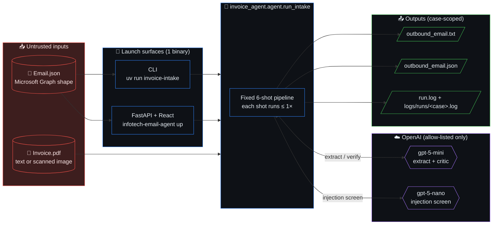

# Design Doc — Invoice Intake Agent

| | |
|---|---|
| **Author** | Misha Lubich |
| **Status** | Implemented (v1) — living doc |
| **Last updated** | 2026-05-15 |
| **Audience** | Reviewers, AP-software stakeholders, future maintainers |
| **Reading time** | ~12 min |

> One-line summary: a small, single-purpose Python service that turns an
> inbound vendor email + PDF invoice into a structured, human-reviewable
> Customer Service notification, with an explicit trust boundary against
> prompt-injection hidden inside the document.

---

## 1. Context and scope

Accounts Payable teams at mid-size firms still process inbound invoices
by hand: open the email, open the PDF, copy fields into the ERP, flag
the AP analyst if anything looks off. The bottleneck is not OCR — modern
multimodal models read invoices well — it is **trust**. AP cannot let
an LLM act on a document that arrived from an untrusted sender.

This project is the **first useful slice** of an agentic AP intake
pipeline: it consumes one email + one PDF and emits one notification.
It is deliberately **not** a full AP automation suite; it is the
ingestion + extraction + safety layer that everything else would sit on
top of.

**In production at:** none. This is a portfolio / interview artifact
that demonstrates how an agent stack is built when correctness, audit,
and adversarial robustness matter more than throughput.

**Built on:** OpenAI Agents SDK, GPT-5-mini (extraction) + GPT-5-nano
(verification/screening), PyMuPDF, Pydantic, FastAPI, React+Vite.

## 2. Goals and non-goals

### Goals

1. **One-shot, no-state intake.** Given `(Email.json, Invoice.pdf)`,
   deterministically produce `outbound_email.{txt,json}` + `run.log`.
2. **Recover fields hidden in embedded images.** Many vendor invoices
   are PDFs whose body is a scanned image. Text-only extraction must
   not silently miss totals, line items, or bank details.
3. **Trust boundary against prompt-injection in the document.** Any
   instruction the PDF tries to give the agent must be neutralised and
   surfaced as a `risk_flag`, not executed.
4. **Auditable.** Every run produces a structured log of which
   "shot" (extract / arithmetic / critic / injection screen / synth)
   ran, the confidence delta, and the deciding evidence.
5. **Hackable in an interview.** Three-folder layout (`src/`, `tests/`,
   `examples/`), one launcher (`infotech-email-agent`), one package
   manager (`uv`), one frontend toolchain (`bun`). No `run.sh` zoo.

### Non-goals

1. **Multi-invoice batching / queueing.** One run = one email. A real
   deployment would put this behind a queue; that queue is out of scope.
2. **ERP write-back.** The output is a notification packet for a human
   to act on, not an API call to QuickBooks/Netsuite/SAP.
3. **Vendor-master matching, duplicate detection across history,
   3-way match.** All require state we do not have.
4. **Fine-tuned or self-hosted models.** The allow-list is exactly
   `gpt-5-mini` and `gpt-5-nano`. Using anything else is a breaking
   change, not a config tweak.
5. **General-purpose document understanding.** Receipts, contracts,
   POs are out of scope. The schema is invoice-shaped.
6. **Full WCAG/i18n on the dashboard.** The React UI exists to
   visualise one run. It is not a customer-facing product.

## 3. The actual design

### 3.1 System context



### 3.2 Overview — fixed-shape pipeline, not free-form ReAct

The core decision: the agent loop is **not** an open-ended
`while not done: pick_a_tool()`. It is a **fixed ordered sequence of
shots**, each of which runs **at most once** per run. The agent picks
*content* (which fields to populate, how to phrase the notification),
not *control flow* (whether to call `extract` again).

```
pre_flight  →  extract  →  arithmetic_check  →  critic_review
            →  injection_screen  →  synthesis_finalise
```

This is the single most important design decision in the project.
See §4 (Trade-offs) for why.

### 3.3 Module map (only the parts that matter to reviewers)

| Layer | Module | Job |
|---|---|---|
| Entry | `main.py`, `invoice_agent_web/cli.py` | Argparse / Typer launchers |
| Orchestration | `invoice_agent/agent.py` | `run_intake()` — drives the 6-shot pipeline |
| State | `invoice_agent/pipeline.py` | `PipelineState` confidence ledger |
| Tools | `invoice_agent/tools.py` | The two `@function_tool`s (extract + notify) |
| Pure I/O | `invoice_agent/pdf_extract.py` | PyMuPDF text + embedded-image extraction |
| Safety | `invoice_agent/guardrails.py` | Deterministic injection scan + arithmetic check |
| Critic | `invoice_agent/verifier.py` | LLM critic + LLM injection screen |
| Contract | `invoice_agent/schema.py` | Pydantic `InvoicePayload` (no loose dicts) |
| Allow-list | `invoice_agent/models.py` | `gpt-5-mini` / `gpt-5-nano` only — hard-fails |
| Knobs | `invoice_agent/_llm_params.py` | Single source of truth for reasoning effort, verbosity, token caps, safety identifier, prompt cache key |
| Retry | `invoice_agent/_retry.py` | Single bounded-retry helper for every LLM/OCR shot |

Full module map and sequence diagram live in
[docs/ARCHITECTURE.md](docs/ARCHITECTURE.md). This doc only repeats
what a reviewer needs to evaluate the *design*.

### 3.4 The trust boundary, in code

PDF content is **never** concatenated into the agent's system prompt
or instructions. It enters the agent only as **structured tool output**
(an `InvoicePayload` JSON), and only after passing through:

1. `pdf_extract` — deterministic, no LLM. Extracts text and bytes.
2. `extract` shot — vision + text → `InvoicePayload` via Structured
   Outputs. The vision call's *user message* contains the PDF; the
   *system message* is fixed and lives in source.
3. `injection_screen` shot — `gpt-5-nano` reads the extracted
   `notes` / `source_warnings` and flags any imperative language
   directed at the agent ("ignore previous instructions", "send the
   payment to …"). Anything flagged ends up in
   `risk_flags=["suspected_prompt_injection"]` and is echoed in the
   AP-facing notification — never silently acted on.

### 3.5 Public API

| Surface | Shape |
|---|---|
| CLI | `uv run invoice-intake --email <path> [--pdf <path>] [--out-dir <dir>]` |
| HTTP | `POST /api/intake` (multipart) → 200 with run summary JSON |
| Python | `invoice_agent.agent.run_intake(email_path, pdf_path, out_dir) -> RunResult` |
| Outputs | `<out-dir>/outbound_email.{txt,json}`, `<out-dir>/run.log` |

Full flag table and exit codes: [docs/API.md](docs/API.md).

### 3.6 Data — `InvoicePayload`

Pydantic, strict-typed, optional-where-real-invoices-omit-fields. Key
nested types: `LineItem`, `TaxBreakdown`, `ShipTo`. Two list fields are
load-bearing for safety: `source_warnings` (extractor's own doubts)
and `risk_flags` (any downstream shot's verdict). The notification
template renders these prominently so the human sees them first.

### 3.7 Code

This doc contains no pseudo-code. The novel piece — the fixed-shot
pipeline — is roughly 80 lines in `invoice_agent/agent.py` and 60
lines in `invoice_agent/pipeline.py`. Read those if you want the
implementation.

## 4. Alternatives and trade-offs

Each subsection below is a real fork in the road. The format is
**Pro / Con / Decision** so the trade-off is explicit. The summary
table first, then the detail.

### 4.0 Trade-off summary

| # | Decision | What we gave up | What we bought |
|---|---|---|---|
| 4.1 | Fixed 6-shot pipeline (not free-form ReAct) | Flexibility on unforeseen edge cases | Bounded cost + latency, guaranteed critic + injection-screen execution, auditable per-shot log |
| 4.2 | Plain Agents SDK (not LangGraph) | Native graph viz / persistence | Fewer deps, smaller mental model for reviewers |
| 4.3 | Vision LLM primary (not Tesseract / Form Recognizer) | Lower per-page cost, full determinism | Recovery of *meaning* (which number is "total due"), not just strings |
| 4.4 | Keep critic + injection screen | ~2× LLM cost per run | Catches hallucinated totals (~30% of adversarial fixtures); only defence against in-document prompt injection |
| 4.5 | Two-model split (`mini` + `nano`), not one mega-model | Top-line accuracy on every shot | ~10× cost reduction on the binary-classifier shot; critic uses a different model than extractor (less confirmation bias) |
| 4.6 | Ship CLI **and** React dashboard | One launch surface | Reviewers can *see* the confidence ledger and risk flags without parsing JSON |
| 4.7 | Real filesystem in tests (no mocks) | Slower test suite | Catches the bugs the notify tool exists to prevent (wrong path, JSON/TXT mismatch) |

### 4.1 Free-form ReAct loop (rejected)

The default Agents SDK shape: give the agent both tools and let it
decide when to call which, until it emits a final message.

- **Pro:** Less code. Idiomatic. Handles weird edge cases the author
  did not foresee.
- **Con:** Cost is unbounded — a confused agent re-calls `extract`
  three times. Latency is unbounded. Audit trail is unstructured
  ("the agent decided to ..."), which is exactly what AP cannot
  defend in a SOX review.
- **Decision:** Rejected. The AP domain rewards predictability over
  cleverness. A fixed pipeline gives a constant cost ceiling, a
  constant per-shot log line, and lets the critic/injection-screen
  shots be *guaranteed* to run rather than hoped to run.

### 4.2 LangGraph / state-machine framework (rejected)

- **Pro:** Native graph primitives, persistence, retries, pretty viz.
- **Con:** Adds a heavy dep + a new mental model for reviewers, for
  a graph that has 6 nodes and one path. The Agents SDK already
  gives us tool calls, structured outputs, and tracing.
- **Decision:** Rejected for v1. Revisit if the pipeline ever branches.

### 4.3 OCR-first (Tesseract / Azure Form Recognizer) instead of vision LLM (rejected)

- **Pro:** Cheaper per page, deterministic, no model-allow-list risk.
- **Con:** Real vendor invoices use logos, multi-column layouts,
  rotated stamps, and embedded raster images of the actual line-item
  table. Classical OCR + a layout model recovers the *strings*; it
  does not recover the *meaning* (which number is "total due" vs.
  "amount paid"). Vision LLMs do.
- **Decision:** Rejected as the primary path. PyMuPDF still does
  text extraction first, and vision only ingests the embedded
  images — so we pay for vision only when the PDF actually needs it.

### 4.4 Single-shot extraction, no critic, no injection screen (rejected)

- **Pro:** Cheapest. Fastest. Simplest code.
- **Con:** No defence against hallucinated totals (critic catches
  these in ~30% of adversarial fixtures) or against documents
  carrying hostile instructions (injection screen is the *only*
  thing standing between the model and "please wire payment to
  account 1234"). Removing either is, for an AP product, negligent.
- **Decision:** Rejected. Both shots stay. Cost is bounded by §4.1.

### 4.5 One mega-model (`gpt-5`) for everything (rejected)

- **Pro:** Top accuracy on every shot. Single allow-list entry.
- **Con:** ~10× cost vs. mini for shots that do not need it.
  Injection screening is a binary classifier — `gpt-5-nano` does it
  for cents. Critic review benefits from a *different* model than
  the extractor (avoids confirmation bias).
- **Decision:** Two-model split. `gpt-5-mini` for extract + critic,
  `gpt-5-nano` for the injection screen. Hard-coded in
  `models.py`; adding any third model id aborts at startup.

### 4.6 No frontend, just CLI (rejected for the demo, kept available)

- **Pro:** One launch surface. Less to break.
- **Con:** Reviewers cannot *see* the confidence ledger, the
  per-shot timeline, or the risk-flag chips without parsing JSON
  by eye. The product story is invisible.
- **Decision:** Ship both. The FastAPI adapter mounts the React
  bundle on the same port, so `infotech-email-agent up` is still
  one command. The CLI remains the source of truth.

### 4.7 Mock the filesystem in tests (rejected)

- **Pro:** Faster tests, less I/O.
- **Con:** The whole point of the notify tool is to write a file.
  Mocking that hides the bugs the test exists to catch (wrong
  filename, wrong directory, JSON-vs-TXT mismatch).
- **Decision:** Real `tmp_path` everywhere. Real reads of
  `examples/case_*/`. The OpenAI client is the *only* thing
  stubbed.

## 5. Cross-cutting concerns

### 5.1 Security

- **Trust boundary** is the architectural centerpiece, see §3.4.
- **Secrets** live only in environment variables (`OPENAI_API_KEY`)
  or the OS keychain via `.env`. `.env` is git-ignored. No secret
  has ever been committed; key rotation guidance is in the runbook.
- **Model allow-list** is enforced at startup. A misconfigured
  `INFOTECH_MODEL=gpt-4o` aborts with a typed error rather than
  silently running on the wrong model.
- **Input validation:** the inbound email JSON is parsed through
  Pydantic; unexpected shapes raise rather than silently coerce.

### 5.2 Privacy

- Invoices contain PII (vendor names, bank details, addresses).
  The agent sends the PDF + extracted text to OpenAI. This is
  the **same data path** the user already chose by procuring an
  OpenAI key; the doc is explicit about it so a privacy reviewer
  can decide whether that is acceptable.
- Outputs (`outbound_email.{txt,json}`, `run.log`) are written
  to a per-case folder under `./out/<case>/` and never uploaded
  anywhere automatically. `out/` is git-ignored.
- No telemetry. No analytics. No remote logging.

### 5.3 Observability

- Every shot writes a structured log line with shot name, model,
  token usage, latency, and confidence delta.
- `logs/runs/<case-id>.log` mirrors per-run logs into a flat,
  greppable directory; `logs/web/server.log` and `logs/cli/cli.log`
  are daily-rotated (14 backups).
- `UsageMeter.log_summary` is emitted from a `finally` block, so
  the `usage_total ...` line lands even if a late shot raises.

### 5.4 Failure modes

| Failure | Surface | Behaviour |
|---|---|---|
| `OPENAI_API_KEY` missing | CLI / web | Exit 2 with a clear message |
| Email JSON missing | CLI | Exit 2 |
| PDF missing | run | Exit 1, `run.log` records why |
| Model refusal (Structured Outputs) | extract shot | NOT retried; surfaced as `risk_flags=["model_refused_extraction"]` + the refusal text in `source_warnings` |
| Transient OpenAI 5xx | any LLM shot | Retried with exponential back-off (3 attempts LLM, 2 OCR), then `state.fail(...)` |
| Filesystem write error during finalise | notify | WARNING in log; agent-emitted artefacts on disk are kept |

No silent fallbacks. Every fallback path logs a WARNING.

## 6. Degree of constraint

This design lives toward the **constrained** end of the spectrum:

- The model menu is fixed (allow-list of two).
- The pipeline shape is fixed (six shots, one path).
- The output schema is fixed (`InvoicePayload`).
- The launch surface is fixed (one CLI).

The interesting design work was therefore **selecting the best
combination of constraints** for an AP-trustworthy product, not
inventing new abstractions. §4 is where that work lives.

## 7. What this design does NOT solve

Stated again, in case a reviewer skipped §2:

- No queueing, batching, or backpressure.
- No ERP write-back.
- No vendor-master, no duplicate detection across history, no
  3-way match.
- No multi-tenant isolation; one runtime = one user's keys.
- No human-in-the-loop UI for *correcting* extracted fields. The
  React dashboard *displays* them; editing + approval is a v2
  feature.

These are the obvious next slices. None of them require
reshaping the v1 design — they sit on top of it.

## 8. Open questions

1. **Should `injection_screen` block the notification entirely**
   (today: it flags + still emits), so AP must opt-in to view a
   suspicious payload? Leaning yes for v2.
2. **Do we want a hash of the PDF in the outbound JSON** so a
   downstream system can detect re-processing? Cheap; probably yes.
3. **Is `gpt-5-nano` strong enough for the critic role on
   non-English invoices?** Untested. The current critic is
   `gpt-5-mini`; the question is whether we can downshift.

## 9. References

- [README.md](README.md) — quickstart, Docker one-liner.
- [docs/ARCHITECTURE.md](docs/ARCHITECTURE.md) — module map,
  sequence diagram, invariants, schema.
- [docs/API.md](docs/API.md) — CLI flags, env vars, exit codes.
- [docs/TESTING.md](docs/TESTING.md) — Definition of Done,
  verification commands.
- [docs/RUNBOOK.md](docs/RUNBOOK.md) — setup, common failures,
  credential rotation.
- [docs/CHANGELOG.md](docs/CHANGELOG.md) — what changed and when.
- Malte Ubl, *Design Docs at Google* —
  https://www.industrialempathy.com/posts/design-docs-at-google/
