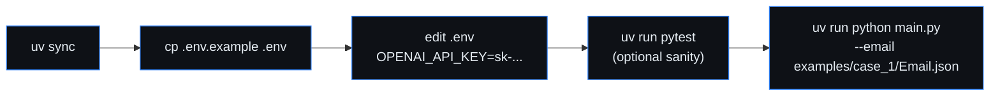

# Runbook

## Table of contents

- [First-time setup](#first-time-setup)
- [Run a case](#run-a-case)
- [Common failures](#common-failures)
- [Rotating credentials](#rotating-credentials)
- [Adding a new case](#adding-a-new-case)

## First-time setup



```bash
uv sync
cp .env.example .env
# edit .env, set OPENAI_API_KEY=sk-...
```

`.env` is git-ignored. If a real key was ever pasted into chat, a commit,
or shell history, rotate it at https://platform.openai.com/api-keys before
using it.

## Run a case

```bash
uv run python main.py --email ./examples/case_1/Email.json
```

Artifacts land in `./out/case_1/` at the repo root:

- `outbound_email.txt`
- `outbound_email.json`
- `run.log`

Override locations if needed:

```bash
uv run python main.py \
  --email ./examples/case_1/Email.json \
  --pdf ./examples/case_1/Invoice.pdf \
  --out-dir ./out/manual_run \
  --log-file ./out/manual_run/run.log
```

## Common failures

| Symptom | Likely cause | Fix |
|---|---|---|
| Exit 2, `OPENAI_API_KEY is not set` | `.env` missing or empty | `cp .env.example .env`, paste key. |
| Exit 2, `email file not found` | Bad `--email` path | Use a path under `examples/`. |
| Exit 1, `PDF attachment not found` | Email names a PDF that isn't on disk | Provide `--pdf` or place the PDF beside the email. |
| Exit 1, `No PDF attachment found in email` | `Attachments[]` empty or no PDF entry | Add the attachment metadata or `--pdf` flag. |
| Exit 1, `model … is not allow-listed` | `INVOICE_*_MODEL` set to something other than `gpt-5-mini` / `gpt-5-nano` | Unset the env var or pick an allowed id. |

## Rotating credentials

1. Revoke the old key in the OpenAI dashboard.
2. Generate a new one.
3. Update `.env` locally; never commit it.

## Adding a new case

1. Create `examples/case_<n>_<slug>/`.
2. Drop `Email.json` (Microsoft Graph–style `Message`) and `Invoice.pdf`.
3. Run: `uv run python main.py --email ./examples/case_<n>_<slug>/Email.json`.
4. Outputs go to `./out/case_<n>_<slug>/`.

## Web dashboard (optional)

A React + Vite + TypeScript dashboard ships under `frontend/` and is
served by a Typer CLI (`src/invoice_agent_web/cli.py`, console-script
**`infotech-email-agent`**) that mounts the built bundle and the
FastAPI adapter on a single port.

### One-shot launch (recommended)

```bash
uv sync
uv run infotech-email-agent           # builds frontend if needed, opens browser
```

That prints an ASCII banner + diagnostics, builds the React bundle
(via `bun`) on first run, and serves the whole app at
<http://127.0.0.1:8000/>. Subcommands:

| Command | Purpose |
|---|---|
| `infotech-email-agent` (no args) | alias for `up` |
| `infotech-email-agent up [--port 8000] [--host 127.0.0.1] [--rebuild] [--no-browser]` | build + serve dashboard + API on one port |
| `infotech-email-agent dev [--port 8000]` | run backend with auto-reload; Vite dev (`bun run dev`) is a separate terminal proxying `/api/*` |
| `infotech-email-agent doctor` | print env / dependency diagnostics |
| `infotech-email-agent version` | print package version |

Drop an `Email.json` + `Invoice.pdf` into the upload zone, or click any
of the shipped example cases. The dashboard renders the pipeline
confidence gauge, per-shot timeline, risk-flag chips, the extracted
invoice (vendor, totals, line items), and the outbound packet (human
summary, full JSON, run-log tail).

Per-request artefacts land under `out/web/<timestamp>_<slug>_<id>/` (or
the path in `INVOICE_WEB_RUNS_DIR`). See `frontend/README.md` for env
vars and production-build notes.

### Common dashboard failures

| Symptom | Likely cause | Fix |
|---|---|---|
| `OPENAI_API_KEY is not set` (CLI exits 2) | `.env` missing or empty | `cp .env.example .env` and paste the key. |
| Browser shows JSON `frontend bundle missing` (HTTP 503) | The React bundle hasn't been built | Run `infotech-email-agent up --rebuild` (needs Bun on `$PATH`). |
| `ERROR: Bun is not installed` | Bun not on `$PATH` | Install from <https://bun.sh>, or build manually in `frontend/` and re-run `up`. |
| `email upload must be a .json file` (HTTP 400) | Wrong file type dropped | Drop the `Email.json` file, not the PDF. |
| `PDF attachment not found: …` (HTTP 400) | Email's `Attachments[].Name` doesn't match the uploaded PDF, and no PDF was uploaded | Either upload the PDF in the same drop or rename it to match. |
| `intake crashed: AgentRunner.run_sync() cannot be called when an event loop is already running` | Adapter route accidentally declared `async def` | Keep `/api/intake` and `/api/intake/example` as **sync** handlers; FastAPI dispatches them on a worker thread. |

## Containerized run (Docker)

The repo ships a multi-stage [Dockerfile](../Dockerfile) and a
[docker-compose.yml](../docker-compose.yml). Stages:

- `frontend` — `oven/bun` builds the React/Vite bundle.
- `base` — `python:3.12-slim` + `uv sync --frozen --no-dev` + `tesseract-ocr`.
- `runtime` — runs `infotech-email-agent up --no-browser --host 0.0.0.0 --port 8000`.
- `test` — adds dev deps + `tests/`. `CMD` runs `uv run pytest -q`.

### One-command spin-up

```bash
echo "OPENAI_API_KEY=sk-..." > .env
docker compose up
# open http://localhost:8000/
```

`out/` is mounted as a volume so per-case artefacts
(`outbound_email.{txt,json}` + `run.log`) persist on the host.

### Plain `docker run`

```bash
docker build -t infotech-agent .
docker run --rm -p 8000:8000 \
           -e OPENAI_API_KEY=$OPENAI_API_KEY \
           -v "$PWD/out:/app/out" \
           infotech-agent
```

### Test image

The offline pytest suite needs no `OPENAI_API_KEY` (the SDK is stubbed
in `tests/conftest.py`):

```bash
docker compose run --rm tests           # via compose (profile=tests)
# or
docker build -t infotech-agent-tests --target test .
docker run --rm infotech-agent-tests
```

### Common container failures

| Symptom | Fix |
|---|---|
| `OPENAI_API_KEY is not set` at startup | Make sure `.env` exists in the build/run context, or pass `-e OPENAI_API_KEY=...`. |
| Port 8000 already bound on host | Map a different host port: `-p 9000:8000` (or set `ports: ["9000:8000"]` in compose). |
| `permission denied` writing under `/app/out` | The `out/` bind-mount on the host must be writable by your UID; `chmod g+w out/` or run with `--user "$(id -u):$(id -g)"`. |
| Build fails on `bun install` | Network blocked the Bun image; run `docker pull oven/bun:1.3-alpine` first, or set a proxy in your Docker daemon. |
